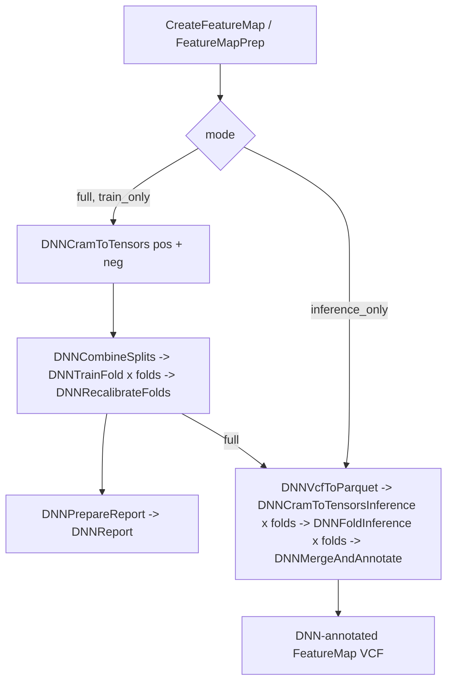

# Deep Single Read SNV (DeepSRSNV) pipeline

> **Note:** This workflow is suitable for **UG200** (R-amp library). For UG100 data, see the [Single Read SNV (SRSNV) pipeline](howto-single-read-snv.md).

## Table of Contents
- [Introduction](#introduction)
  - [What DeepSRSNV does](#what-deepsrsnv-does)
  - [How it differs from XGBoost SingleReadSNV](#how-it-differs-from-xgboost-singlereadsnv)
  - [Model architecture](#model-architecture)
  - [Training set and labels](#training-set-and-labels)
  - [Cross-validation scheme](#cross-validation-scheme)
  - [Quality recalibration (MQUAL to SNVQ)](#quality-recalibration-mqual-to-snvq)
  - [Inference backends](#inference-backends)
  - [Reproducibility](#reproducibility)
- [Modes](#modes)
  - [full](#full)
  - [train_only](#train_only)
  - [inference_only](#inference_only)
  - [Mode summary](#mode-summary)
- [Variables (WDL inputs/outputs)](#variables-wdl-inputsoutputs)
  - [Primary inputs](#primary-inputs)
  - [Mode and model inputs](#mode-and-model-inputs)
  - [Parameter structs](#parameter-structs)
  - [Annotation files and multi-VCF filtering](#annotation-files-and-multi-vcf-filtering)
  - [Scatter, memory and execution](#scatter-memory-and-execution)
  - [Outputs](#outputs)
- [Output VCF annotation fields](#output-vcf-annotation-fields)
- [Pipeline steps (tasks)](#pipeline-steps-tasks)
- [Running the pipeline](#running-the-pipeline)
- [Dockers](#dockers)
- [Template descriptions](#template-descriptions)

## Introduction

### What DeepSRSNV does
Deep Single Read SNV (DeepSRSNV) is a **read-centric SNV de-noising** pipeline: for every candidate single-read SNV in a CRAM it assigns a calibrated, Phred-scaled quality score (**SNVQ**) that estimates the probability the SNV is a true variant rather than a sequencing, library, or alignment artifact. It is the deep-learning counterpart of the XGBoost-based [Single Read SNV (SRSNV)](howto-single-read-snv.md) pipeline and produces the same style of DNN-quality-annotated FeatureMap VCF.

The pipeline is built around a per-read binary classifier (true SNV vs. artifact). It is trained per sample using cross-validation, and the trained model is applied back to the sample (or to new samples) to annotate each SNV with a recalibrated quality. Training and inference tasks require a **GPU-enabled** execution environment.

### How it differs from XGBoost SingleReadSNV
The XGBoost SRSNV model consumes **tabular, per-read engineered features** — one row of scalar columns (motif, quality summaries, fragment features, etc.) per read. DeepSRSNV instead consumes the **full read as a multi-channel 1-D signal** of fixed length (`tensor_length`, default 300) — essentially a single-read "pileup image" aligned to the reference — so the network learns directly from the raw per-base sequence, quality, and flow context around the candidate SNV rather than from hand-crafted summaries.

Both pipelines share the same upstream FeatureMap generation (`snvfind`) and the same output quality semantics (calibrated SNVQ, PASS/LowQual filtering), which makes their outputs directly comparable.

### Model architecture
The model is a **1-D residual convolutional network** (`CNNReadClassifier`) that outputs a single logit per read (trained with binary cross-entropy):


Two configuration files control the feature representation and are shared across tensorization, training, and inference:
- `channel_registry` (`channel_registry.json`) — selects and orders the tensor channels.
- `vocab_config` (`vocab.json`) — the base/attribute token vocabularies.

### Training set and labels
Labels are assigned when reads are turned into tensors:
- **Positive (label 1)** — reads from randomly selected bases matching the reference genome (the "true" set).
- **Negative (label 0)** — reads supporting low-VAF (≤5%) SNVs in high-coverage regions (low-support candidates, likely artifacts).

The biological definition of the positive/negative sets is produced by the upstream FeatureMap / `snvfind` step (the positive/negative training parquets); the DNN pipeline consumes those parquets together with the CRAM.

### Cross-validation scheme
DeepSRSNV uses **chromosome-disjoint k-fold cross-validation** to avoid overfitting:
- `holdout_chromosomes` (default `chr21`) are held out as a global test set that is never trained on.
- The remaining chromosomes are partitioned into `num_folds` folds, balanced by chromosome length.
- For fold *i*, the model trains on all non-test chromosomes not in fold *i* and validates on fold *i*. This yields `num_folds` independently trained models.
- At inference, each read is scored by the **out-of-fold** model (the model whose validation fold contains that read's chromosome), preserving cross-validation validity end-to-end.

A `pretrained_checkpoint` can be supplied to **warm-start / fine-tune** — the model weights are loaded, but the optimizer and learning-rate schedule restart, so training runs the configured schedule from a good initialization rather than resuming.

### Quality recalibration (MQUAL to SNVQ)
The raw model probability is converted to a Phred-scaled **MQUAL** ("model quality"). Because raw model scores are not directly interpretable as error rates, a recalibration step (`recalibrate_dnn_folds`) builds a **shared MQUAL→SNVQ lookup table (LUT)** from the folds' validation predictions:

- For each MQUAL threshold it computes true/false positive rates and combines them with a coverage- and prevalence-based prefactor (derived from the `snvfind` stats funnel and mean coverage) to produce a genome-wide, Phred-scaled error estimate.
- The resulting LUT (`quality_recalibration_table`) is patched into each fold's metadata, producing the **`updated_fold_metadata`**.

> **Important:** inference and annotation must consume the **recalibrated `updated_fold_metadata`**, not the raw per-fold training metadata (`fold_metadata`). When you feed a pre-trained model into `inference_only` mode (see [inference_only](#inference_only)), the `inference_models.fold_metadata` array must be the `updated_fold_metadata` from a prior training run.

### Inference backends
- **`trt`** (default, production) — runs the exported TensorRT `.engine` on GPU.

### Reproducibility
By default (`deep_srsnv_params.deterministic = false`), GPU training is **not** reproducible: cuDNN autotuning selects kernels by timing (which varies run-to-run), so re-running the same sample yields slightly different model weights and metrics (typically within ~0.1% AUC). Data preparation (`cram_to_tensors`, `combine_splits`) is already reproducible because it is seeded and CPU-only.

Set `deep_srsnv_params.deterministic = true` to make **training and inference reproducible run-to-run on the same GPU model + CUDA/cuDNN/TensorRT versions**, while staying fast. When enabled, the pipeline:

- enables deterministic algorithms and deterministic cuDNN convolutions, sets `CUBLAS_WORKSPACE_CONFIG`, and turns off cuDNN autotuning (`benchmark`), which is the actual run-to-run nondeterminism source;
- **keeps TF32 and AMP (fp16) on** — both are deterministic on a fixed GPU and are the main speedups, so this mode targets *reproducibility* (same result every run), not bit-equivalence with a full-FP32 reference;
- runs training on a single GPU (no DDP gradient-reduction-order variance, no `sqrt(n_devices)` LR scaling);
- seeds the training data-loader shuffle from `random_seed`;
- keeps the TensorRT engine at FP16 with a persisted timing cache so rebuilding from the same ONNX yields a bit-identical engine.

Note: the timing cache and seeded shuffle are always on (both modes); `deterministic` additionally pins the kernel-selection/precision knobs above.

#### Reproducing inference results exactly
A serialized TensorRT `.engine` is not portable across GPU/TRT environments, and the engine build itself is timing-sensitive: the same ONNX built twice can select slightly different kernels unless the same **timing cache** is reused, which shifts SNVQ by ~0.01 Phred. Every run therefore emits, per fold, both the ONNX model (`fold_onnx_models`) and the timing cache it was built with (`fold_trt_timing_caches`).

To **reproduce the exact inference scores** of a prior run, launch `mode = "inference_only"` and pass that run's artifacts back in `inference_models` — specifically `fold_onnx_models` **and** `fold_timing_caches` (plus `fold_metadata` = the run's `updated_fold_metadata`, and `fold_checkpoints`). The engine is rebuilt in-runtime from the ONNX using the supplied cache, which recreates the original engine bit-for-bit (verified: same ONNX + same cache → identical annotated VCF). Keep `batch_size` and the GPU type the same as the original run. Omitting `fold_timing_caches` still works but the rebuilt engine may differ by ~0.01 Phred.

Notes and caveats:
- Reproducibility holds only on the **same GPU type** and the same CUDA/cuDNN/TensorRT stack — pin `gpu_type` (and the docker image) for runs you need to reproduce. Reproducing a specific released model also requires the same `pretrained_checkpoint`.
- Inference probabilities are only reproducible when `batch_size` is held constant (the TensorRT batch profile can select different kernels for a different last-partial-batch size).
- **Cost:** because TF32/AMP are kept, the overhead comes only from disabling cuDNN autotuning and forcing single-GPU deterministic kernels — expected to be modest and much smaller than a full-FP32 deterministic mode. GPU inference cost is essentially unchanged. Leave it off for production throughput and enable it for reproducibility/validation runs.

## Modes

The workflow is driven by a single `mode` input. All modes share a common preamble (globals, genome resources) and, unless a pre-computed FeatureMap is supplied, the FeatureMap-preparation sub-workflow. The following flowchart shows the shared stages and where each mode stops or branches:



### full
Default mode. Trains a model on the input sample **and** runs inference to annotate the FeatureMap VCF. Runs, in order: FeatureMap preparation (with training-set parquet generation) → tensorize positive/negative reads → combine + k-fold split → train each fold → recalibrate folds → QC report; and in parallel the inference branch → vcf-to-parquet → per-fold inference tensors → per-fold GPU inference → merge and annotate.

Produces: the FeatureMap VCF, the trained fold model artifacts (checkpoints, ONNX, engines, metadata, `updated_fold_metadata`), the DNN-annotated `featuremap_vcf`, and the QC report. `inference_models` must **not** be supplied.

### train_only
Runs the training branch only (FeatureMap prep → tensorize → combine/split → train folds → recalibrate → QC report). Produces the trained fold model artifacts and the QC report, but **no** DNN-annotated VCF (the inference branch is skipped). Use this to produce a reusable model that can later be applied with `inference_only` Or in case you need just QC metrics without output vcf.

### inference_only
Applies a **provided pre-trained N-fold model** (`inference_models`) to a sample without any training. There are two sub-cases:

- **With `input_featuremap_vcf`** (+ index): CreateFeatureMap / FeatureMap preparation is **skipped** and inference runs directly on the supplied FeatureMap VCF (vcf-to-parquet → inference tensors → per-fold inference → merge/annotate). No coverage input is required in this sub-case.
- **Without `input_featuremap_vcf`**: FeatureMap preparation runs to create the FeatureMap VCF (no training parquets are generated), then the same inference chain follows.

The number of folds is inferred from the length of `inference_models.fold_metadata`. As noted in [Quality recalibration](#quality-recalibration-mqual-to-snvq), `inference_models.fold_metadata` **must be the recalibrated `updated_fold_metadata`** from the training run that produced the model, otherwise SNVQ will be uncalibrated.

### Mode summary

| mode | CreateFeatureMap | tensorize | train + recalibrate | QC report | inference / annotated VCF | required extra inputs |
|---|---|---|---|---|---|---|
| `full` | yes | yes | yes | yes | yes | — |
| `train_only` | yes | yes | yes | yes | no | — |
| `inference_only` | only if no `input_featuremap_vcf` | no | no | no | yes | `inference_models` (recalibrated) |

## Variables (WDL inputs/outputs)

Naming convention: curly braces denote WDL variable names (e.g. `{input_cram_bam}`, `{deep_srsnv_params}`).

### Primary inputs
- `{input_cram_bam}` (+ `{input_cram_bam_index}`) — the input CRAM/BAM and its index.
- `{base_file_name}` — base name for output files (must not contain spaces, `#`, `,`, or the substrings `test`/`train`).
- Coverage — provide **either** `{sorter_json_stats_file_list}` (sorter JSON stats, from which mean coverage and total aligned bases are extracted) **or** both `{mean_coverage}` and `{total_aligned_bases}`. (Not required for `inference_only` with a supplied `{input_featuremap_vcf}`.)
- `{reference_genome}` — genome selector; only `hg38` is supported.

### Mode and model inputs
- `{mode}` — one of `full` (default), `train_only`, `inference_only`.
- `{inference_models}` — a `DeepSRSNVModel` struct; required in (and only allowed in) `inference_only`:
  - `fold_metadata` (`Array[File]`) — per-fold **recalibrated** metadata JSONs (the `updated_fold_metadata` of a prior training run). The fold count is derived from this array's length.
  - `fold_checkpoints` (`Array[File]`) — per-fold `.ckpt` files.
  - `fold_onnx_models` (`Array[File]?`) — per-fold `.onnx` files (required for the `trt` backend).
  - `fold_engines` (`Array[File]?`) — per-fold TensorRT `.engine` files (required for the `trt` backend).
- `{input_featuremap_vcf}` (+ `{input_featuremap_vcf_index}`) — optional pre-computed FeatureMap VCF for `inference_only`; when supplied, CreateFeatureMap is skipped.

### Parameter structs
`{deep_srsnv_params}` (`DeepSRSNVParams`) controls the DNN:

| Field | Meaning | Template value |
|---|---|---|
| `num_folds` | k-fold count | 3 |
| `tensor_length` | padded read length (channels × length) | 300 |
| `shard_size` | rows per tensor shard | 25000 |
| `num_tensorize_workers` | parallel workers for `cram_to_tensors` (drives memory/CPU of tensorize tasks) | 8 |
| `holdout_chromosomes` | comma-separated global test-set chromosomes | `chr21` |
| `random_seed` | reproducibility seed | 0 |
| `epochs` | max training epochs | 5 |
| `patience` | early-stopping patience (on validation AUC) | 5 |
| `batch_size` | training/inference batch size | 512 |
| `learning_rate` | learning rate | 0.001 |
| `lr_scheduler` | `cosine` or `onecycle` | `cosine` |
| `use_amp` | mixed-precision training | true |
| `deterministic` | reproducible training + inference run-to-run (see [Reproducibility](#reproducibility)); deterministic kernels + no cuDNN autotuning + single GPU, keeps TF32/AMP for speed. Optional | false |
| `pretrained_checkpoint` | optional `.ckpt` for warm-start fine-tuning | ramp_ppmseq baseline |
| `gpu_count` | GPUs for training tasks | 1 |
| `training_gpu_count` | GPUs for training (default `gpu_count`; set 1 to avoid `/dev/shm` issues) | 1 |
| `gpu_type` | GPU type (default `nvidia-tesla-t4`) | `nvidia-tesla-a10g` |
| `inference_backend` | `trt` or `pytorch` | `trt` |
| `low_qual_threshold` | SNVQ threshold for the PASS filter | 40.0 |
| `dnn_merge_chunk_size` | max prediction rows per `DNNMergeAndAnnotate` chunk (memory tuning; lower it to shrink per-chunk footprint). Optional | 2500000 |
| `dnn_merge_max_parallel_chunks` | max chunks processed concurrently in `DNNMergeAndAnnotate` (memory tuning; lower it to cap concurrent memory). Optional | 4 |
| `channel_registry` | channel selection/order config (`channel_registry.json`) | see template |
| `vocab_config` | token vocabulary config (`vocab.json`) | see template |

Other params:
- `{featuremap_params}` (`FeatureMapParams`) — `snvfind` parameters (min mapping quality, padding, score limits, tags to copy, bed file, read filters, random-sample generation, etc.). Recommended values are set per use case in the template.
- `{single_read_snv_params}` (`SingleReadSNVParams`) — training-set preparation (train-set sizes, sampling overhead, `num_CV_folds`, max coverage factor, max VAF for FP).
- `{features}` (`Array[String]`) — feature list used in the QC report's quality plots.
- `{random_sample_trinuc_freq}` (`File?`) — optional CSV/TSV trinucleotide frequencies for the random sample.

### Annotation files and multi-VCF filtering
`{annotation_files}` (`FeaturemapAnnotationFiles`) carries the always-on annotation resources plus optional user-supplied VCF sets that tag SNVs in the FeatureMap and control which SNVs are used for training vs. inference:

- **Always-on annotations** — `dbsnp`(+index) adds the dbSNP `ID`, `gnomad`(+index) adds the population allele frequency (`gnomAD_AF`), and `ug_hcr`(+index) marks whether the SNV falls in the UG High-Confidence Regions (`UG_HCR`).
- **`exclude_from_training_vcf_list`** (+index list) — one or more VCFs whose positions are tagged with the `{exclude_from_training_field_name}` INFO flag (default `EXCLUDE_TRAINING`). SNVs matching these VCFs are **removed from the training set** (both positive and negative label collection) but are still emitted in the FeatureMap and still scored at inference. Use it to keep specific loci out of what the model learns from — e.g. a known mutation signature, a spike-in, or germline sites you don't want the model to fit to.
- **`include_in_inference_vcf_list`** (+index list) — one or more VCFs whose positions are tagged with the `{include_in_inference_field_name}` INFO flag (default `INCLUDE_INFERENCE`). Before annotation these VCFs are filtered with `{include_vcf_bcftools_filter_args}` (template: `-f PASS --type snps -m2 -M2`, i.e. PASS-only biallelic SNPs). This flag marks the sites you specifically want scored at inference time, independent of whether they were part of training.
- **`pcawg_vcf`** (+index) — a PCAWG (Pan-Cancer Analysis of Whole Genomes) somatic-catalog VCF; matching positions are tagged with the `{pcawg_field_name}` INFO flag (default `PCAWG`). PCAWG behaves as a **combined exclude + include** field: like `exclude_from_training_vcf_list`, it is injected as an `is_null` training-exclusion filter (PCAWG loci are kept out of the training set); and, **when an `include_in_inference_vcf_list` is also supplied**, it is added alongside `{include_in_inference_field_name}` to the inference-inclusion set (`any_not_null`), so PCAWG loci are scored at inference. (If no include list is given, PCAWG contributes only the training exclusion.)

**Signature-based cost reduction (T/N + `num_folds=1`).** The exclude/include mechanism enables a much cheaper single-fold training scheme without the usual overfitting risk. Provide your **tumor (T)** calls as an `include_in_inference_vcf_list` and your **matched-normal (N)** (or a broader germline/somatic panel) as an `exclude_from_training_vcf_list`, so that the SNVs you actually care about — the signature you want to score — are **excluded from training** and only reached at **inference**. Because the model never trains on the signature loci, scoring them is inherently out-of-sample even with a single fold. This lets you set `deep_srsnv_params.num_folds = 1` (train one model on the rest of the genome, infer on the signature) instead of the default 3-fold cross-validation — roughly a 3× reduction in training cost and an even larger reduction in inference cost — while avoiding the overfitting that a single-fold model would otherwise incur on its own training loci.

### Scatter, memory and execution
- `{num_shards_featuremap}` — number of genomic shards for the `snvfind` scatter.
- `{scatter_interval_list}` — interval list defining the scatter regions (should match `featuremap_params.bed_file`).
- `{override_memory_gb_CreateFeatureMap}`, `{override_memory_gb_PrepareRawFeatureMap}`, `{override_memory_gb_PrepareRandomSampleFeatureMap}` — memory overrides for those tasks.
- `{raise_exceptions_in_report}` — fail the pipeline if the QC report raises an error.
- `{preemptible_tries}`, `{no_address_override}`, `{cloud_provider_override}`, `{monitoring_script_input}` — execution controls.

### Outputs
All outputs are optional (a given output is produced only in the modes that generate it).

| Output | Produced in | Description |
|---|---|---|
| `{featuremap}` (+ index) | any mode running FeatureMap prep | FeatureMap VCF with all SNV candidates |
| `{featuremap_random_sample}` (+ index) | FeatureMap prep | downsampled FeatureMap VCF for training |
| `{random_sample_trinuc_freq_stats}` | FeatureMap prep | trinucleotide frequency stats of the random sample |
| `{downsampling_rate}` | FeatureMap prep | downsampling rate used |
| `{positive_parquet}` / `{negative_parquet}` | training | positive (random-sample) / negative (raw) training parquets |
| `{featuremap_vcf}` (+ index) | inference modes (`full`, `inference_only`) | DNN-quality-annotated FeatureMap VCF |
| `{fold_metadata}` | training | per-fold metadata JSONs (raw, from training) |
| `{fold_checkpoints}` / `{fold_onnx_models}` / `{fold_engines}` | training | per-fold model artifacts |
| `{updated_fold_metadata}` | training | per-fold metadata with the shared recalibration LUT |
| `{combined_metadata}` | training | shared recalibration LUT metadata |
| `{featuremap_df}` | training | combined FeatureMap DataFrame with per-fold predictions |
| `{report_html}` / `{application_qc_h5}` | training | QC report and application QC statistics |

> To run `inference_only` later, feed a prior training run's `{fold_checkpoints}`, `{fold_onnx_models}`, `{fold_engines}`, and **`{updated_fold_metadata}`** into the `inference_models` struct.

## Output VCF annotation fields
The DNN-annotated FeatureMap VCF (`{featuremap_vcf}`) carries the following DNN quality fields (written by `dnn_merge_and_annotate`):

| Name | Where | Number | Type | Description |
|---|---|---|---|---|
| MQUAL | FORMAT | . | Float | DNN model quality score (Phred-scale), one value per supporting read |
| SNVQ | FORMAT | . | Float | Recalibrated SNV quality score (Phred-scale), one value per supporting read |
| QUAL | (locus) | 1 | Float | Maximum SNVQ across the reads at the site |
| FILTER | (locus) | — | — | `PASS` if max SNVQ ≥ `low_qual_threshold` (default 40), else `LowQual` |

All other FeatureMap fields (INFO/FORMAT annotations such as `FILT` / `FILT_BITMAP`, the pre-filter bitmaps, motif and fragment annotations, etc.) originate from the upstream FeatureMap / `snvfind` step and are documented in the [SingleReadSNV howto](howto-single-read-snv.md#list-of-featuremap-fields); the DNN step only adds MQUAL/SNVQ and sets QUAL/FILTER.

## Output file contents
This section documents what each non-VCF output file contains (the `{featuremap_vcf}` fields are covered above).

### `featuremap_df` parquet
Combined FeatureMap DataFrame written by `DNNRecalibrateFolds` from each fold's validation and held-out predictions. Columns:

| Column | Description |
|---|---|
| `CHROM`, `POS`, `RN` | Locus contig/position and read name (join keys) |
| `label` | Boolean true/false-SNV training label |
| `fold_id` | Fold index `0…k-1` for a fold's validation rows; `null` for test/holdout rows |
| `prob_orig` | Model probability — validation rows use their own fold's prediction, test/holdout rows use the mean across folds |
| `MQUAL` | Phred-scaled model quality, recomputed from `prob_orig` |
| `prob_fold_0 … prob_fold_{k-1}` | Per-fold probabilities (one column per fold) |
| `SNVQ` | Recalibrated SNV quality from the shared MQUAL→SNVQ LUT |
| *feature columns* | When training featuremap parquets are supplied, all raw FeatureMap feature columns (e.g. `REF`, `X_ALT`, `X_HMER_REF`/`X_HMER_ALT`, `EDIST`, `HAMDIST`, `MAPQ`, coverage fields) are joined in on `(CHROM, POS, RN)`; the exact set follows the FeatureMap VCF schema (see the [SingleReadSNV FeatureMap fields](howto-single-read-snv.md#list-of-featuremap-fields)) |

> The QC-report step (`prepare_dnn_report`) additionally derives `ML_qual_{fold}` columns from `prob_fold_*` for plotting; those live in the report's internal parquet, not in the surfaced `{featuremap_df}`.

### Model metadata JSONs
`{fold_metadata}` — one JSON per fold produced by training (`*.srsnv_dnn_metadata.json`). Top-level keys:

| Key | Contents |
|---|---|
| `model_type` | model identifier (`deep_srsnv_cnn_lightning`) |
| `channel_order`, `encoders` | tensor channel order and per-field vocabularies (`base`, `ref_base`, `t0`, `tm`, `st`, `et`) |
| `model_architecture` | CNN architecture parameters |
| `training_parameters` | training hyperparameters (`k_folds`, `epochs`, `patience`, `batch_size`, `learning_rate`, `hidden_channels`, `n_blocks`, `dropout`, `length`, …) |
| `training_results` | per-epoch train/validation curves (`validation_0`/`validation_1` → `logloss`, `auc`) |
| `holdout_metrics`, `split_prevalence`, `chunk_composition` | held-out performance and label balance |
| `split_manifest`, `split_summary` | fold/chromosome split and set sizes (`n_train`/`n_val`/`n_test`) |
| `best_checkpoint_paths`, `onnx_path`, `trt_engine_path` | model artifact paths |
| `data_paths`, `preprocess` | fold data directory and preprocessing timing |
| `quality_recalibration_table` | `null` at training time (filled in by recalibration — see below) |

`{updated_fold_metadata}` — each fold's metadata after recalibration, adding: `quality_recalibration_table` = `[x_lut, y_lut]` (the shared MQUAL→SNVQ LUT), `filtering_stats` = `{negative, positive}` (funnel stats, see below), and extra `training_parameters` (`max_qual`, `effective_bases_covered`, `snvq_prefactor`).

`{combined_metadata}` (`shared_lut_metadata.json`) — the shared recalibration metadata:

| Key | Contents |
|---|---|
| `quality_recalibration_table` | shared MQUAL→SNVQ LUT `[x, y]` |
| `filtering_stats` | `negative` / `positive` funnel stats |
| `lut_method` | `kde` or `counting` |
| `lut_points` | number of LUT points |
| `snvq_range` | `[min, max]` of the recalibrated SNVQ |
| `k_folds` | number of CV folds |
| `fold_parquets`, `fold_metadata_paths` | inputs used to build the LUT |

### `stats_funnel` JSON
The `snvfind` model-filters status funnel (surfaced as `{stats_funnel}` in `data_prep_only` mode; consumed during training as `--stats-file`). Two top-level sections:
- `filters_full_output` — the full dataset (negative / FP training data),
- `filters_random_sample` — the random sample (positive / TP training data).

Each section contains:
- `filters` — per-filter entries, each with `name`, `type` (`quality` / `region` / `downsample` / `raw`), `field`, `op`, `value`, `funnel` (cumulative surviving rows) and `pass` (rows passing that filter alone),
- `single_effect` — each filter's independent drop count,
- `combinations` / `combinations_total` — co-occurrence counts of filter pass/fail patterns.

> The cumulative row count is under `funnel` in the current format (older files used `rows`); readers accept either.

### `application_qc_h5`
HDF5 of QC statistics embedded into `{report_html}` (produced by `srsnv_report`). Keys:

| Key | Contents |
|---|---|
| `run_info_table` | sample name, read length/coverage, %TP reads, mixed-read fractions, pipeline/docker/adapter versions |
| `run_quality_summary_table` | median SNVQ, recall at SNVQ 50/60, pre-filter recall, ROC AUC per read category |
| `training_info_table` | number of CV folds and per-fold/total dataset sizes |
| `roc_auc_table` | ROC AUC total / mixed / non-mixed, per-fold mean±std, holdout mean±std |
| `run_quality_table`, `run_quality_table_display` | percentile stats of QUAL / ML_qual / ML_logit across TP/FP/mixed conditions |
| `bases_over_qual_threshold` | fraction of TP-read bases retained at each Phred quality threshold |
| `FQ_recall_LoD` | per-MQUAL recall / FQ curves by read category |
| `ppmseq_category_quality_table`, `ppmseq_category_quantity_table` | median QUAL and % of data per ppmSeq start/end tag category |
| `training_progress` | per-epoch, per-fold train/validation logloss and auc |
| `trinuc_stats` | trinucleotide-context counts and quality (forward/reverse, TP/FP) |
| `quality_histogram`, `logit_histogram` | density histograms of QUAL / ML_logit by read category |
| `keys_to_convert` | list of the above keys to be JSON-exported |

## Feeding the MRD FeatureMap workflow
The MRD whole-genome analysis workflow (`MRDFeatureMap`, see the [MRD WG analysis howto](howto-mrd-wg-analysis.md)) consumes three DeepSRSNV outputs. Its input names still follow the legacy SingleReadSNV output names, so from a DeepSRSNV source wire them as:

| MRD input | DeepSRSNV output | Purpose in MRD |
|---|---|---|
| `cfdna_featuremap` (+ `cfdna_featuremap_index`) | `{featuremap_vcf}` (+ `{featuremap_vcf_index}`) — the DNN-quality-annotated VCF | candidate SNV loci and their per-read qualities;
| `featuremap_df_file` | `{featuremap_df}` | SRSNV model dataframe (features, labels, qualities) passed to `MrdDataAnalysis` |
| `srsnv_metadata_json` | `{combined_metadata}` | SNV-quality model metadata passed to `MrdDataAnalysis`|


## Pipeline steps (tasks)
Each task runs a console script inside its docker image (referenced here by its globals variable name — see [Dockers](#dockers)). Only `DNNTrainFold` and `DNNFoldInference` require a GPU; all other tasks are CPU-only.

- **CreateFeatureMap** (`snvfind`, `featuremap_docker`) — generates the raw FeatureMap VCF (all SNV candidates) plus the random-sample VCF and a filter-status funnel. Scattered across `num_shards_featuremap` genomic intervals inside the `FeatureMapPrep` sub-workflow, then concatenated. `FeatureMapPrep` also prepares the positive/negative training parquets (`PrepareFeatureMapForTraining` → `featuremap_to_dataframe`) when training-set prep is enabled.
- **DNNCramToTensors** (`cram_to_tensors`, `ugbio_deep_srsnv_docker`) — turns CRAM reads + a training parquet into sharded read tensors; run once for the positive label and once for the negative label.
- **DNNCombineSplits** (`combine_splits`, `ugbio_deep_srsnv_docker`) — combines the positive/negative tensor caches and performs the chromosome-disjoint k-fold split, producing per-fold `train/val/test` tensor directories and a split manifest.
- **DNNTrainFold** (`deep_srsnv_training`, `ugbio_deep_srsnv_docker`, **GPU**) — trains one fold (optionally warm-started from `pretrained_checkpoint`), exporting the best checkpoint, an ONNX model, a TensorRT engine, a predictions parquet, and per-fold metadata. Scattered over `num_folds`.
- **DNNRecalibrateFolds** (`recalibrate_dnn_folds`, `ugbio_deep_srsnv_docker`) — builds the shared MQUAL→SNVQ LUT from the folds' validation predictions and patches it into each fold's metadata (`updated_fold_metadata`); also emits the combined FeatureMap DataFrame and the shared LUT metadata.
- **DNNVcfToParquet** (`featuremap_to_dataframe`, `ugbio_featuremap_docker`) — converts the FeatureMap VCF to a parquet for inference.
- **DNNCramToTensorsInference** (`cram_to_tensors --label inference`, `ugbio_deep_srsnv_docker`) — pre-computes per-fold inference tensors (fold assignment by chromosome). Scattered over folds.
- **DNNFoldInference** (`dnn_fold_inference_from_cache`, `ugbio_deep_srsnv_docker`, **GPU**) — runs per-fold inference from the tensor cache (TensorRT by default), producing per-fold read-level predictions. Scattered over folds.
- **DNNMergeAndAnnotate** (`dnn_merge_and_annotate`, `ugbio_deep_srsnv_docker`) — merges per-fold predictions, applies the recalibration LUT, and writes MQUAL/SNVQ and QUAL/FILTER into the FeatureMap VCF, producing `{featuremap_vcf}`.
- **DNNPrepareReport / DNNReport** (`prepare_dnn_report` / `srsnv_report`, `ugbio_deep_srsnv_docker` / `ugbio_srsnv_docker`) — build the QC report inputs and the HTML report + application QC h5.

## Running the pipeline
DeepSingleReadSNV runs on Cromwell and AWS HealthOmics (Omics). Training and inference require GPU nodes.

Select the behavior with the `mode` field in the input JSON (default `full`). Start from the input template `wdls/input_templates/deep_single_read_snv_template.json` and its `ramp_ppmseq` use-case block, overriding only what differs.

Run via the `wdls` CLI, for example:
```bash
# Validate the workflow and inputs
wdls workflow=[DeepSingleReadSNV] action=[validate] target=all

# Run a named regression test on Omics
wdls workflow=[DeepSingleReadSNV] action=[run] run.test_type=[long] \
  run.test_names=[ramp_ppmseq.poolA_604435_L13572]
```

The per-mode regression tests under `tests/tests_inputs/regression_tests/nightly/deep_single_read_snv.*.json` are concrete, runnable examples of each mode:
- `...train_only.json` — `mode = train_only`.
- `...inference_only_no_fmap.json` — `mode = inference_only` with a provided `inference_models`, letting the workflow build the FeatureMap.
- `...inference_only_with_fmap.json` — `mode = inference_only` with both `inference_models` and `input_featuremap_vcf` (CreateFeatureMap skipped).

Docker image tags are resolved automatically from `wdls/tasks/globals.wdl`; see [Dockers](#dockers).

## Dockers
The pipeline uses the following docker images, referenced by their globals variable names (the concrete image tags are defined in `wdls/tasks/globals.wdl` / `globals.yaml`):
- `ugbio_deep_srsnv_docker` — the DNN tasks (tensorize, combine, train, recalibrate, inference, merge/annotate, report preparation).
- `ugbio_featuremap_docker` — FeatureMap-to-parquet and FeatureMap-prep helper tasks.
- `ugbio_srsnv_docker` — the QC report (`srsnv_report`) and sorter-stats extraction.
- `featuremap_docker` — CreateFeatureMap (`snvfind`) and VCF concat/filter helpers.
- `broad_gatk_docker` — interval-list scattering.

## Template descriptions

| Template file | Description |
|---|---|
| `wdls/input_templates/deep_single_read_snv_template.json` | The DeepSingleReadSNV input template. Provides top-level defaults (annotation files, DNN params, scatter config, field names) plus the `ramp_ppmseq` use-case block, which sets the `ramp_ppmseq`-specific `single_read_snv_params`, `featuremap_params`, `deep_srsnv_params`, and `features`. |
