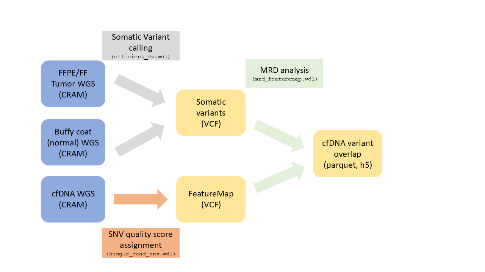

# MRD WG Analysis

## Table of Contents
- [Introduction](#introduction)
- [Template descriptions](#template-descriptions)
- [Running the pipeline](#running-the-pipeline)
  - [Step 1: Somatic variant calling](#step-1-somatic-variant-calling)
  - [Step 2: Single Read SNV (SRSNV) pipeline](#step-2-single-read-snv-srsnv-pipeline)
  - [Step 3: Intersection and MRD data analysis](#step-3-intersection-and-mrd-data-analysis)
- [MRD detection and reporting](#mrd-detection-and-reporting)
  - [Locus filters](#locus-filters)
  - [Statistical detection](#statistical-detection)
  - [Sample-specific LOD](#sample-specific-lod)
  - [QC checks](#qc-checks)
  - [Filter funnels](#filter-funnels)
- [WDL task reference](#wdl-task-reference)
  - [Part 1 — Filter signatures](#part-1--filter-signatures)
  - [Part 2 — Coverage extraction](#part-2--coverage-extraction)
  - [Part 3 — FeatureMap intersection](#part-3--featuremap-intersection)
  - [Part 4 — MRD data analysis](#part-4--mrd-data-analysis)
- [Summary of the important MRD output files](#summary-of-the-important-mrd-output-files)
- [Summary of the relevant files](#summary-of-the-relevant-files)
- [test files](#test-files)

## Introduction

The UG pipeline for tumor informed MRD measures the tumor fraction in cfDNA from the presence of tumor-specific SNVs. The input data is generally 3 aligned cram files:
- cfDNA (plasma)
- Tumor tissue (FFPE / FF)
- Normal tissue (buffy coat / PBMCs)

It is possible to provide the cfDNA cram file only, with an existing somatic vcf file.

The analysis is composed of three parts:
1. Tumor signature mutation calling, where the tumor and normal tissues are used for finding the tumor somatic mutations signature with somatic variant calling (by default UG Somatic Efficient DeepVariant [efficient_dv.wdl], though these can be provided from other callers).
2. Single Read SNV pipeline, where all the SNV candidates compared to the reference genome are extracted from the cfDNA cram file to a FeatureMap vcf, annotated and assigned a quality score (SNVQ).
3. Intersection and MRD data analysis, where the FeatureMap and signature are intersected and filtered, then reads supporting the tumor mutations are counted and a circulating tumor variant allele fraction (ctDNA VAF) is measured. Control signatures can be added to estimate the background noise, e.g. from other cohort patients, and in addition control signatures are generated from a somatic mutation database. A statistical detection call (MRD Detected / Not Detected / Indeterminate) is made against the noise model derived from the synthetic control signatures, and a sample-specific limit of detection (LOD) is estimated.



This pipeline describes step #3, the intersection and MRD data analysis, once #1 and #2 are completed.

## Template descriptions

The following input templates are available for different kinds of input data:

| Template File | Description |
|---------------|-------------|
| `mrd_featuremap_template-Matched-signature-with-cohort-with-quality-filtering.json` | Use this template to run MRD using a matched signature, including cohort controls (non-matched mutation signature vcf). Quality filtering is applied to matched and control signatures (suitable for EfficientDV output). |
| `mrd_featuremap_template-Matched-signature-without-cohort-with-quality-filtering.json` | Use this template to run MRD using a matched signature, without cohort controls (non-matched mutation signature vcf). Quality filtering is applied to matched and signature (suitable for EfficientDV output). |
| `mrd_featuremap_template-Matched-signature-with-cohort-without-quality-filtering.json` | Use this template to run MRD using a matched signature, with cohort controls (non-matched mutation signature vcf). Quality filtering is not applied to matched and signature (suitable for vcf files without a QUAL field). |
| `mrd_featuremap_template-Healthy-without-matched-with-cohort-with-quality-filtering.json` | Use this template to run MRD on a healthy control plasma without a matched signature, with cohort controls (non-matched mutation signature vcf). Quality filtering is applied to matched and signature (suitable for EfficientDV output). |

## Running the pipeline
### Step 1: Somatic variant calling
Please refer to instruction in one of:
1. WDL - efficient_dv.wdl

2. Standalone - howto-somatic-calling-efficient-dv.md

The following outputs from this workflow are needed:
1. vcf_file - A vcf file containing the mutations found in the tumor tissue, with a quality score (QUAL) assigned to each mutation. Mutations suspected as germline appear in this vcf and are filtered out and marked RefCall in the FILTER column. The output vcf file is used as input to the next step.

### Step 2: Single Read SNV (SRSNV) pipeline
Please refer to instruction in one of:
1. WDL - single_read_snv.wdl

2. Standalone - howto-single-read-snv.md

The following outputs from this workflow are needed:
1. featuremap - Output FeatureMap, a VCF file that contains a record per variant (SNV), with aggregated information per read in the FORMAT fields. Additional information about variant is encoded in the INFO fields. Additionally, a machine learning model is trained on these features to assign an SNV quality score, saved in the SNVQ FORMAT field per read. The maximal SNVQ per variant is saved in the QUAL field. 
2. featuremap_index - index of the FeatureMap vcf file
3. application_qc_h5 - A file containing statistics about the test set used to train the machine learning model, saved as a h5 file.
4. featuremap_df - a parquet file containing the training dataset with labels and predictions
5. srsnv_metadata_json - A metadata JSON file for the SNV quality model, containing information about the model, features, and training parameters


### Step 3: Intersection and MRD data analysis 
In this stage the FeatureMap and signature are intersected, reads supporting the tumor mutations are counted and the circulating tumor variant allele fraction (ctDNA VAF) is measured. ctDNA VAF can be used to estimate the tumor fraction in plasma. 
In this stage control signatures can (and should) be added to estimate the background noise. In addition a mutation database is used for estimating background noise (see below). The synthetic (database) control signatures are what makes the statistical detection call possible — without them the call is Indeterminate (see [MRD detection and reporting](#mrd-detection-and-reporting)).
The WDL used in this stage is: mrd_featuremap.wdl

Either when using the WDL or running as standalone, the following inputs are needed:
1. General parameters

  a. base_file_name - Sample's base file name / sample name, will be used in the output files' name

  b. include_regions - region/s to which the analysis will be limited, multiple regions would be intersected. Default:
    
    [
      "gs://concordanz/hg38/UG-High-Confidence-Regions/v1.3/ug_hcr.bed"
    ]
    or 
    [
      "s3://ultimagen-workflow-resources-us-east-1/hg38/UG-High-Confidence-Regions/v1.3/ug_hcr.bed"
    ]

  c. exclude_regions_bed - BED regions that will be excluded from the analysis by position. Default:

    1. MRD_blacklist: loci with high error rate in an internal HapMap project in UG

    Optionally, one can add a bed file of germline variants of the corresponding sample, to exclude from MRD analysis.

    [
      "gs://concordanz/hg38/annotation_intervals/UG_MRD_blacklist_v0.bed"
    ]
    or
    [
      "s3://ultimagen-workflow-resources-us-east-1/hg38/annotation_intervals/UG_MRD_blacklist_v0.bed"
    ]

  d. exclude_regions_vcf / exclude_regions_vcf_indices - VCF files whose variants are excluded from the signatures by **exact locus and alt allele** (not by position), so a signature SNV is only dropped when the same substitution appears in the exclusion VCF. Must be bgzipped and tabix-indexed, and the two arrays must be given in the same order. Default:

    1. [GNOMAD](https://gnomad.broadinstitute.org/): common population variants.

    2. [db_snp](https://www.ncbi.nlm.nih.gov/snp/): common population variants.

    3. PON (panel of normals): recurrent artifactual substitutions observed in UG healthy cfDNA samples.

    [
      "gs://concordanz/hg38/somatic/af-only-gnomad.hg38.snps.AF_over_1e-3.vcf.gz",
      "gs://concordanz/hg38/somatic/Homo_sapiens_assembly38.dbsnp138.chr1-22XY.snps.vcf.gz",
      "gs://concordanz/hg38/mrd/pon.version1.vcf.gz"
    ]
    or
    [
      "s3://ultimagen-workflow-resources-us-east-1/hg38/somatic/af-only-gnomad.hg38.snps.AF_over_1e-3.vcf.gz",
      "s3://ultimagen-workflow-resources-us-east-1/hg38/somatic/Homo_sapiens_assembly38.dbsnp138.chr1-22XY.snps.vcf.gz",
      "s3://ultimagen-workflow-resources-us-east-1/hg38/mrd/pon.version1.vcf.gz"
    ]

  e. references - Reference genome. Default:

    {
      "ref_fasta": "gs://gcp-public-data--broad-references/hg38/v0/Homo_sapiens_assembly38.fasta",
      "ref_fasta_index": "gs://gcp-public-data--broad-references/hg38/v0/Homo_sapiens_assembly38.fasta.fai",
      "ref_dict": "gs://gcp-public-data--broad-references/hg38/v0/Homo_sapiens_assembly38.dict"
    }

2. Input signatures

  a. external_matched_signature - a single somatic vcf file matching the plasma sample (e.g. a signature from a tumor biopsy). All loci in this signature will be excluded from the control signatures, implemented with bcftools_extra_args string (see below) before intersection with the FeatureMap.

  b. external_control_signatures - A list of control signatures that can be added to estimate the background noise, e.g. from other cohort patients. The control signatures are filtered with bcftools_extra_args.

  c. bcftools_extra_args - A string used by bcftools for filtering the matched and control signatures. Default:

    "-f PASS --type snps -m2 -M2 -i 'QUAL>10'"

  This expression filters out all non-SNVs, non-biallelic SNVs and SNVs with a quality score lower than 10. To disable filtering on quality, use:
    
    "-f PASS --type snps -m2 -M2"

  d. snv_database - a large database of whole-genome somatic cancer mutations from which variants for synthetic control signatures (also called database controls) will be drawn. Default is the PCAWG database (Nature 2020). The synthetic signatures are generated based on the matched signature: they have the same size and same trinucleotide motif distribution as the first matched signature. In case matched signatures are not part of the input, the sythetic signatures mimic the first control signature. The synthetic signatures appear as "db_control" signatures in the output ctdna_vaf.h5, and are the source of the background noise rate used by the statistical detection. snv_database default:
  
    "gs://concordanz/hg38/pcawg/pancan.filtered.vcf.gz"
    or
    "s3://ultimagen-workflow-resources-us-east-1/hg38/pcawg/pancan.filtered.vcf.gz"

  e. n_synthetic_signatures - number of synthetic signatures to generate from the database. Default: 30. This is also the QC threshold for a reliable null distribution — with fewer synthetic controls the "Synthetic controls" QC check is flagged. Set to 0 to disable generation of database controls altogether (the detection call then becomes Indeterminate).

  f. diluent_germline_vcfs - optional argument. A list of vcf files which are output of germline calling of the diluent's DNA, in case of an experiment where patient's cfDNA was diluted into a cfDNA coming from a healthy donor, or a similar mixing experiment. Default: empty array []
  

3. Inputs from Single Read SNV pipeline

  a. cfdna_featuremap - SRSNV output: featuremap

  b. cfdna_featuremap_index - SRSNV output: featuremap_index

  c. featuremap_df_file - SRSNV output: featuremap_df

  d. srsnv_metadata_json - SRSNV output: srsnv_metadata_json
    
4. Analysis filters
  
  b. mrd_analysis_params - filters and statistical parameters used in the final analysis step (`MrdDataAnalysis`). Only the two query fields are required; the rest are optional and fall back to the module defaults.

  | Field | Required | Default | Description |
  |---|---|---|---|
  | `signature_filter_query` | yes | `"(norm_coverage <= 2.5) and (norm_coverage >= 0.6)"` | Locus-level filter on the signature. Filters out variants found in regions of extreme coverage of the cfDNA sample. |
  | `read_filter_query` | yes | `"filt>0 and snvq>60 and mapq>=60"` | Read-level filter on the intersected FeatureMap: take only entries with pass filter, high SNVQ and maximal mapping quality. |
  | `tumor_sample` | no | auto-discovered | Sample name in the signature vcf from which the allele fraction (AF) is taken. |
  | `mrd_detection_fpr` | no | `0.01` | Significance threshold for the detection call (see [Statistical detection](#statistical-detection)). |
  | `lod_fpr` | no | `0.05` | False-positive rate used to set the detection threshold for the sample-specific LOD. |
  | `lod_recall` | no | `0.95` | Target recall (detection probability) for the sample-specific LOD. |
  | `thresh_noise_lq_reads` | no | disabled | Noisy-loci filter threshold, in (0, 1]. Set e.g. `0.7` to enable (see [Locus filters](#locus-filters)). |
  | `thresh_multi_read_pvalue` | no | `0.001` | Multi-read locus filter threshold. Set `0.0` to disable. |

  In order to take only mixed reads from a ppmSeq data, the following read_filter_query should be applied:

    "read_filter_query" : "(st == 'MIXED') and (et == 'MIXED')"

## MRD detection and reporting

The final analysis step (`MrdDataAnalysis`, running `generate_report` from the `ugbio_mrd` package) produces
two HTML reports — a results report (`mrd_analysis_report.html`) and a QC report (`mrd_qc_report.html`) — plus
a machine-readable `detection_result.json` and full tables in `ctdna_vaf_h5`. Beyond the ctDNA VAF measurement it applies optional per-locus
noise filters, makes a statistical detection call, and estimates a sample-specific limit of detection.

### Locus filters

Two optional pre-detection filters remove noisy loci before the detection test is run. Both are configured
via `mrd_analysis_params`, and loci removed by either filter are also removed from the coverage denominator so
the ctDNA VAF stays consistent.

#### Noisy-loci filter (`thresh_noise_lq_reads`)

Removes loci where the fraction of low-quality reads (reads *failing* `read_filter_query`) exceeds the
threshold. This targets loci systematically affected by assay noise rather than true ctDNA signal.

The threshold must be in the range (0, 1]. **Disabled by default**; a value of `1.0` is equivalent to
disabling it (a fraction can never exceed 1). Set e.g. `0.7` to remove loci where more than 70% of the reads
are low quality.

#### Multi-read locus filter (`thresh_multi_read_pvalue`)

Removes loci whose per-locus supporting-read count is a significant outlier under a Poisson null model. The
primary target is germline or mosaic variants leaking into the matched signature, but the test is applied
identically per signature — the matched signature, each cohort control and each synthetic replicate are each
tested on their own. Default: `0.001`; set `0.0` to disable.

**λ estimation:** for each signature, the VAF is estimated from all of its loci
(`VAF = total reads / corrected_coverage`, with a Jeffreys prior `0.5 / (N+1)` when no reads are observed at
all), and the per-locus expectation uses the *local* coverage rather than a single global mean:

$$\lambda_i = \mathrm{VAF} \times \text{coverage}_i$$

so high-coverage loci naturally expect more reads and need a higher count before being flagged.

**Bonferroni N — per signature:** each signature is tested independently using **its own locus count** as the
family size N. This is the same logic used by the QC check (see below):

| Signature type | Bonferroni N |
|---|---|
| Matched | matched signature's own locus count |
| Synthetic control (db_control) | that replicate's own locus count |
| Cohort control | that patient's own signature locus count |

Using the matched `signature_size` as a shared N would under-correct large signatures and over-correct small ones.

A locus is flagged when:

$$p_i \times N < \text{thresh\_multi\_read\_pvalue} \quad \text{and} \quad k_i \geq 2$$

The minimum-reads guard (`k ≥ 2`) prevents single-read loci from being removed; a single read is
indistinguishable from background noise regardless of how small λ is. Flagged loci are removed from **all
reads of that signature type**.

### Statistical detection

MRD detection is based on a Binomial test comparing the observed supporting read count at the patient's
matched signature loci against a background noise model derived from the synthetic (`db_control`) signatures.

**Detection p-value:**

$$p = P(X \geq \text{observed reads} \mid \mathrm{Binom}(N,\, p_{err}))$$

where $N$ is the corrected coverage over the final matched signature loci
(signature size × mean coverage × `denom_ratio`, the same denominator used for the reported ctDNA VAF, so
p-value, LOD and VAF all share one N), and $p_{err}$ is the background error rate estimated from the
synthetic controls: the MLE `total db_control reads / total db_control corrected coverage`, or a Jeffreys
prior floor `0.5 / (N + 1)` when zero background reads are observed (avoiding a degenerate null).

**Detection call**, reported in `detection_result.json` and at the top of both reports:

| Call | Condition |
|---|---|
| MRD Detected | p ≤ `alpha` (default 0.01) |
| MRD Not Detected | p > `alpha` |
| Indeterminate | no synthetic controls present, or zero effective coverage — the null model cannot be built |

The reported **detection threshold** is the smallest read count at which the null hypothesis is rejected at
`alpha`, expressed as a VAF (divided by the corrected coverage).

### Sample-specific LOD

The **sample-specific Limit of Detection (LOD)** is the minimum tumor fraction (TF) at which this sample would
be detected with ≥ `lod_recall` probability (default 95%), given this sample's specific assay parameters. It is
*sample-specific* because it depends on the individual signature size, mean coverage, and measured noise rate.

**Derivation:**

1. **Detection threshold** $n_{th}$: the smallest read count where the null hypothesis is rejected at
   FPR = `lod_fpr` (default 5%):

$$n_{th} = \min\{k : P(X \geq k \mid \mathrm{Binom}(N,\, p_{err})) < \mathrm{lod\_fpr}\}$$

2. **LOD** at the target recall (default 95%): the smallest TF such that a true positive sample crosses the
   threshold at the target recall rate:

$$\mathrm{LOD} = \min\{\mathrm{TF} : P(X \geq n_{th} \mid \mathrm{Binom}(N,\, p_{err} + \mathrm{TF})) \geq \mathrm{lod\_recall}\}$$

where $N$ is the same corrected coverage used for the detection p-value. Since recall is monotone increasing
in TF, the root is bracketed on $[0, 1 - p_{err}]$ and solved numerically.

The value reported in `detection_result.json` and in the reports is the **total** VAF, $p_{err} + \mathrm{TF}$,
so it sits on the same scale as the measured ctDNA VAF and as the LOD line drawn in the
"Patient vs. Controls" plot.

The LOD decreases (improves) with larger signature size, higher coverage, or lower noise rate. It is `None`
when no threshold satisfies the FPR constraint (e.g. signature too small or coverage too low), or when the
target recall cannot be reached at any TF.

Note that `lod_fpr` (5%) is deliberately kept separate from the call `alpha` (1%): the LOD answers "what TF
could this assay detect 95% of the time", while `alpha` sets the stringency of the actual call on this sample.

### QC checks

Up to six QC checks are displayed above the Assay Metrics in both reports. They are informational flags and do
**not** force an Indeterminate call.

| Check | Threshold | Rationale |
|---|---|---|
| Signature size | ≥ 500 loci | Too few loci reduce statistical power |
| Mean coverage | ≥ 15× | Low coverage inflates noise rate variance |
| Synthetic controls | ≥ 30 | Fewer controls make the null distribution unreliable |
| Expected multi-read support distribution (matched) | 0 outlier loci (Bonferroni-corrected p ≥ 1%) | See below |
| Expected multi-read support distribution (synthetic controls) | 0 outlier loci (Bonferroni-corrected p ≥ 1%) | See below — only shown when synthetic controls are present |
| Expected multi-read support distribution (cohort controls) | 0 outlier loci (Bonferroni-corrected p ≥ 1%) | See below — only shown when cohort controls are present |

#### Expected multi-read support distribution

These checks detect loci with a significantly higher read count than expected under the respective Poisson
model. A flagged check may indicate germline variants (matched), contamination, or somatic variants leaking
into control signatures. They are computed only when the multi-read locus filter is disabled — when the filter
is active it has already removed those loci, so the check would be vacuous.

**Per-locus Poisson test:** for each locus with `k` observed supporting reads, the right-tail p-value is

$$p_i = P(X \geq k_i \mid \mathrm{Poisson}(\lambda))$$

The expected rate λ differs by check:

| Check | λ per locus | Bonferroni N |
|---|---|---|
| Matched signature | `mean_coverage × matched_vaf` (measured tumor fraction) | matched signature size |
| Synthetic controls (db_control) | `mean_coverage × p_err` (background noise rate) | each synthetic signature's own locus count |
| Cohort controls | `mean_coverage × p_err` (background noise rate) | each cohort signature's own locus count |

**Bonferroni correction for outliers:** a locus is declared an outlier when its p-value falls below the
Bonferroni-corrected threshold $p_i < \alpha_{QC} / N$ with $\alpha_{QC}$ = 1%, and it has at least 2
supporting reads (same guard as the multi-read filter). The family size $N$ differs by group:

- **Matched signature**: $N$ = matched signature size (number of filtered loci passing the signature filter).
- **Synthetic controls** (db_control): each synthetic replicate is tested independently; $N$ = that
  replicate's own locus count. A locus is declared an outlier if the test fires for any single replicate.
  Synthetic controls are population-panel signatures drawn from unrelated samples, so their locus counts can
  differ substantially from the matched signature and from each other.
- **Cohort controls**: same per-signature treatment; $N$ = each cohort patient's own signature size. Cohort
  controls are other patients' matched signatures evaluated on *this* patient's plasma, so their sizes can
  vary widely.

Using the matched `signature_size` as a shared $N$ for either control type would be incorrect: under-correcting
large signatures and over-correcting small ones. The check is flagged when at least one outlier locus is found
across any signature of that type.

### Filter funnels

When a matched signature is given, the reports include two funnels tracking how many variants / reads survive
each filtering step, and the same data is written to `filter_funnel.json`:

- **Signature filter funnel** (loci perspective): the WDL-level steps (`bcftools_extra_args`, include regions,
  exclude regions, exact alt allele filter — collected by the `CollectFilterFunnel` task), then the coverage
  filter (`signature_filter_query`), the LQ-reads locus filter and the multi-read locus filter. The last
  locus-level step is labelled "final signature".
- **Read filter funnel** (plasma read perspective, over final-signature loci): reads covering the signature
  (corrected coverage), reads matching the signature (containing the variant), and reads passing
  `read_filter_query` — the last count is the detection's supporting-read count.

Both funnels are matched-signature only; without a matched signature no `filter_funnel.json` is produced.

## WDL task reference

The `MRDFeatureMap` workflow executes tasks in four sequential parts. The tasks below are defined in
`wdls/tasks/mrd.wdl` (and `wdls/tasks/general_tasks.wdl` for `FilterVcfWithBcftools`).

---

### Part 1 — Filter signatures

#### PadVcf *(optional — only when `diluent_germline_vcfs` is provided)*

Pads each diluent germline variant by ±2 bp and emits a BED file. The padded BED is added to the matched
signature's exclude regions so that germline variants of the diluent donor are not mistaken for signal.

| | |
|---|---|
| **Inputs** | `input_vcf` — diluent germline VCF; `ref_fai` — reference FAI for chromosome sizes |
| **Outputs** | `padded_bed` — BED file of padded variant positions |

---

#### FilterVcfWithBcftools *(applied separately to matched, each cohort control, and the SNV database)*

Filters each signature VCF with `bcftools view` using `bcftools_extra_args` (default: `"-f PASS --type snps
-m2 -M2 -i 'QUAL>10'"`), then restricts to `include_regions` and removes `exclude_regions_bed`. For matched
signatures, the exclude list is the BED-format exclude regions plus any diluent germline padded BED. For
control signatures, the matched signature VCF is additionally added to the exclude list so control loci never
overlap the patient's own mutations.

| | |
|---|---|
| **Inputs** | `input_vcf`; `bcftools_extra_args`; `include_regions` (BED array); `exclude_regions_bed` (BED array) |
| **Outputs** | `output_vcf` + index; `filter_funnel_json` — per-step count JSON (input → after bcftools args → after include → after exclude) |

---

#### FilterSignatureOnExactAltAllele *(optional — only when `exclude_regions_vcf` is provided)*

Removes variants from a signature where the **exact locus and alt allele** appear in any of the exclusion
VCFs (dbSNP, gnomAD, PON). Unlike the region BED exclude, a variant is only removed when the identical
substitution is present in the exclusion VCF — a different alt allele at the same position is kept.

| | |
|---|---|
| **Inputs** | `signature_vcf` + index; `exclude_regions_vcf` — array of bgzipped/tabix-indexed VCFs (dbSNP, gnomAD, PON) |
| **Outputs** | `output_vcf` + index; `exact_alt_funnel_json` — count after exact-alt filtering |

---

#### GenerateControlSignaturesFromDatabase *(optional — only when `snv_database` + `n_synthetic_signatures` are provided)*

Generates `n_synthetic_signatures` synthetic control signatures by sampling from a somatic mutation database
(default: PCAWG), preserving the trinucleotide motif distribution of the reference signature. Synthetic
signatures are the source of the background noise rate for statistical detection — without them the detection
call is Indeterminate. The reference signature is the filtered matched signature when available, otherwise the first cohort control. 
However, statistical inference is applied only when a matched signature is given (See [Part 4 — MRD data analysis](#part-4--mrd-data-analysis)).

| | |
|---|---|
| **Inputs** | `signature_file` — reference signature VCF (for motif profile); `snv_database` — somatic mutation database VCF; `n_synthetic_signatures`; reference genome (fasta + index + dict) |
| **Outputs** | `db_signatures` — array of synthetic VCFs (`syn*.vcf.gz`); `db_signatures_indices` |

---

### Part 2 — Coverage extraction

#### MergeVcfsIntoBed

Combines all filtered signature VCF loci (matched + cohort controls + synthetic controls) into a single
sorted, merged BED file. This BED is the set of positions over which coverage will be extracted.

| | |
|---|---|
| **Inputs** | `vcf_files` — all filtered signature VCFs |
| **Outputs** | `merged_loci_bed` — BED file of merged signature positions |

---

#### ExtractCoverageOverVcfFiles

Runs `mosdepth` on the cfDNA CRAM restricted to the merged signature BED to obtain per-locus read depth.
The resulting coverage BED is used in `MrdDataAnalysis` to compute the corrected coverage denominator for
ctDNA VAF and LOD.

| | |
|---|---|
| **Inputs** | `merged_loci_bed`; `input_cram_bam` + index (cfDNA); `references` (ref fasta/index/dict); `mapping_quality_threshold` (default 0) |
| **Outputs** | `coverage_bed` (`*.regions.bed.gz`) + index — per-locus depth over signature positions |

---

### Part 3 — FeatureMap intersection

#### FeatureMapIntersectWithSignatures *(one task per signature, run in parallel)*

Intersects the cfDNA FeatureMap VCF with one filtered signature using `bcftools isec -n=2 -w1`, retaining
only FeatureMap reads at loci present in the signature. The intersection VCF is then converted to a parquet
file (one row per read) using `featuremap_to_dataframe`. The `signature_type` tag (`"matched"`,
`"control"`, or `"db_control"`) is embedded in the output filename and carried into the parquet.

| | |
|---|---|
| **Inputs** | `featuremap` + index (cfDNA FeatureMap VCF); `signature` + index (filtered signature VCF); `signature_type` |
| **Outputs** | `intersected_featuremap_parquet` — per-read parquet; `intersected_featuremap` + index — intersection VCF; `intersection_funnel_json` — read count after intersection |

---

#### CollectFilterFunnel *(optional — only when a matched signature is present)*

Aggregates the per-step filter counts from the matched signature's `FilterVcfWithBcftools`,
`FilterSignatureOnExactAltAllele`, and `FeatureMapIntersectWithSignatures` JSON outputs into a single
structured JSON. This JSON is consumed by `MrdDataAnalysis` to display the WDL-level steps in the signature
filter funnel table in the HTML reports.

| | |
|---|---|
| **Inputs** | `filter_funnel_jsons` — from `FilterVcfWithBcftools`; `exact_alt_funnel_jsons` — from `FilterSignatureOnExactAltAllele`; `intersection_funnel_jsons` — from `FeatureMapIntersectWithSignatures`; region name arrays (for funnel step labels) |
| **Outputs** | `collected_funnel_json` — combined per-step count JSON passed to `MrdDataAnalysis` |

---

### Part 4 — MRD data analysis

#### MrdDataAnalysis

The main analysis task. Runs `generate_report` from the `ugbio_mrd` package, which:

1. Loads all intersection parquets and signature VCFs.
2. Applies read-level filtering (`read_filter_query`) and optional locus filters (`thresh_noise_lq_reads`,
   `thresh_multi_read_pvalue`).
3. Applies the signature coverage filter (`signature_filter_query`).
4. Computes ctDNA VAF from filtered reads and corrected coverage.
5. Runs statistical detection (Binomial test against the synthetic-control noise rate) and estimates the
   sample-specific LOD.
6. Builds the signature filter funnel and read filter funnel (matched only).
7. Renders the analysis HTML report and the QC HTML report.
8. Writes outputs: feature/signature parquets, detection JSON, ctDna_vaf HDF5, filter funnel JSON.

See [MRD detection and reporting](#mrd-detection-and-reporting) for details on the detection logic.

| | |
|---|---|
| **Inputs** | `intersected_featuremaps_parquet` — all intersection parquets; `matched_signature_vcf`? + `control_signatures_vcf`? + `db_signatures_vcf`?; `coverage_bed`; `mrd_analysis_params` (queries + optional filter/detection params); `featuremap_df_file` — SRSNV featuremap parquet; `srsnv_metadata_json`; `filter_funnel_json`? — from `CollectFilterFunnel` |
| **Outputs** | `features` parquet; `signatures` parquet; `mrd_analysis_html`; `mrd_qc_html`; `detection_result_json`; `ctdna_vaf_h5`; `output_filter_funnel_json`? (matched only) |

---

## Summary of the important MRD output files
- report_html (automated analysis of the results in html format: detection call, ctDNA VAF, sample-specific LOD, QC checks, assay metrics and funnels)
- mrd_qc_html (extended QC report, including the unfiltered-signature and unfiltered-reads analyses and the applied filter summary)
- detection_result_json (machine-readable detection results: call, p-value, supporting reads, ctDNA VAF, detection threshold, personal LOD, signature size, mean/corrected coverage, alpha and the QC checks)
- features_dataframe (python pandas dataframe of all the substitutions in the cfDNA sample after intersection with all the signatures, parquet format)
- signatures_dataframe (python pandas dataframe of all the variants in all the signatures, parquet format)
- ctdna_vaf.h5 (dataframes of ctDNA VAF and supporting reads per locus, plus the `detection_result` and `synthetic_signatures_supporting_reads` keys)
- filter_funnel_json (step-by-step filter funnel counts; produced only when a matched signature is given)

## Summary of the relevant files
- **WDLs:**
  - mrd_featuremap.wdl
  - single_read_snv.wdl
  - efficient_dv.wdl

## test files
```
{cfdna_featuremap}:s3://ultimagen-workflow-resources-us-east-1/test_data/mrd/Pa_46_333_LuNgs_08.featuremap.chr20.vcf.gz
{cfdna_featuremap_index}:s3://ultimagen-workflow-resources-us-east-1/test_data/mrd/Pa_46_333_LuNgs_08.featuremap.chr20.vcf.gz.tbi
{cfdna_cram_bam}:s3://ultimagen-workflow-resources-us-east-1/test_data/single_read_snv/Pa_46.333_LuNgs_08.Lb_744.chr20.cram
{cfdna_cram_bam_index}:s3://ultimagen-workflow-resources-us-east-1/test_data/single_read_snv/Pa_46.333_LuNgs_08.Lb_744.chr20.cram.crai
{external_matched_signature}: "s3://ultimagen-workflow-resources-us-east-1/test_data/mrd/Pa_46_FreshFrozen.ann.chr20.vcf.gz"
{external_control_signatures}: ["s3://ultimagen-workflow-resources-us-east-1/test_data/mrd/Pa_67_FFPE.ann.chr20.vcf.gz"]
{featuremap_df_file}:s3://ultimagen-workflow-resources-us-east-1/test_data/mrd/Pa_46_333_LuNgs_08.featuremap_df.parquet
{snv_database}:s3://ultimagen-workflow-resources-us-east-1/hg38/pcawg/pancan_pcawg_2020.chr20.vcf.gz
{srsnv_metadata_json}:s3://ultimagen-workflow-resources-us-east-1/test_data/mrd/Pa_46_333_LuNgs_08.srsnv_metadata.json
```
