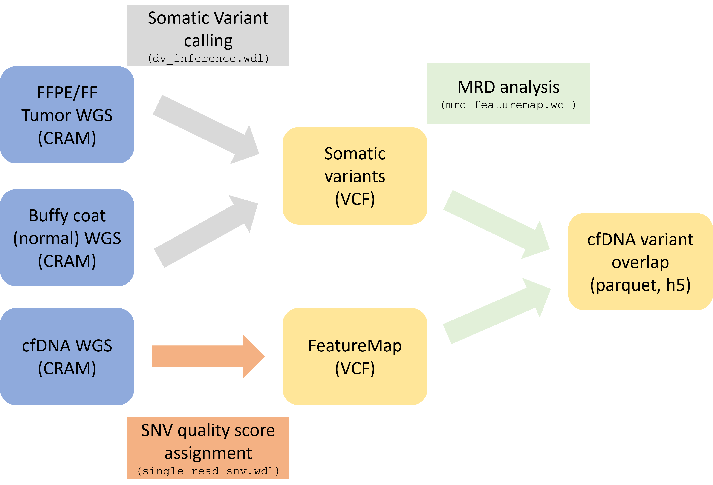

# MRD WG Analysis

## Introduction

The UG pipeline for tumor informed MRD measures the tumor fraction in cfDNA from the presence of tumor-specific SNVs. The input data is generally 3 aligned cram files:
- cfDNA (plasma)
- Tumor tissue (FFPE / FF)
- Normal tissue (buffy coat / PBMCs)

It is possible to provide the cfDNA cram file only with an existing somatic vcf file.

The analysis of this MRD data is composed of three parts:
1. Tumor signature mutation calling, where the tumor and normal tissues are used for finding the tumor somatic mutations signature with somatic variant calling (by default UG Somatic DeepVariant, though these can be provided from other callers).
2. Single Read SNV pipeline, where all the SNV candidates compared to the reference genome are extracted from the cfDNA cram file to a FeatureMap vcf, annotated and assigned a quality score (SNVQ).
3. Intersection and MRD data analysis, where the FeatureMap and signature are intersected and filtered, then reads supporting the tumor mutations are counted and a tumor fraction is measured. Control signatures can be added to estimate the background noise, e.g. from other cohort patients, and in addition control signatures are generated from a somatic mutation database. 



This pipeline describes step #3, the intersection and MRD data analysis, once #1 and #2 are completed.

## Running the pipeline
### Step 1: Somatic variant calling
Please refer to instruction in one of:
1. WDL - dv_inference.wdl

2. Standalone - howto-somatic-calling-dv.md

The following outputs from this workflow are needed:
1. vcf_file - A vcf file containing the mutations found in the tumor tissue, with a quality score (QUAL) assigned to each mutation. Mutations suspected as germline appear in this vcf and are filtered out and marked RefCall in the FILTER column. The output vcf file is used as input to the next step.

### Step 2: Single Read SNV (SRSNV) pipeline
Please refer to instruction in one of:
1. WDL - single_read_snv.wdl

2. Standalone - howto-single-read-snv.md

The following outputs from this workflow are needed:
1. featuremap - Output FeatureMap, a VCF file that contains a record for each SNV in each read. Additional information about the SNV and about the read encoded as INFO fields. Additionally, a machine learning model is trained on these features to assign an SNV quality score, saved as the QUAL field of each SNV in the FeatureMap. 
2. featuremap_index - index of the FeatureMap vcf file
3. test_set_statistics_h5 - A file containing statistics about the test set used to train the machine learning model, saved as a h5 file.
4. X_test_file - X_test file, a numpy array of the features of each SNV in a subsample of reads used as a test set, saved as a parquet file.
5. y_test_file - y_test file, a numpy array of True/False status of the entries in X, saved as a parquet file.
6. qual_test_file - a numpy array of the QUAL values predicted for the test set, saved as a parquet file.


### Step 3: Intersection and MRD data analysis 
In this stage the FeatureMap and signature are intersected, reads supporting the tumor mutations are counted and a tumor fraction is measured. In this stage control signatures can (and should) be added to estimate the background noise, and in addition a mutation database is used to simulate control signatures that mimic the tested signature, in matters of the number of variants and trinucleotide distribution. 
The WDL used in this stage is: mrd_featuremap.wdl
Standalone - howto-mrd-featuremap.md

Either when using the WDL or running as standalone, the following inputs are needed:
1. General parameters

  a. base_file_name - Sample's base file name / sample name, will be used in the output files' name

  b. include_regions - region/s to which the analysis will be limited, multiple regions would be intersected. Default:
    
    [
      "gs://concordanz/hg38/UG-High-Confidence-Regions/v1.3/ug_hcr.bed"
    ]

  c. exclude_regions - regions that will be excluded from the analysis, supporting bed and vcf formats. Default:
    1. GNOMAD: common population variants
    2. db_snp: common population variants
    3. MRD_blacklist: loci with high error rate in an internal HapMap project in UG
    Optionaly, one can add a list of germline variants of the corresponding sample, to exclude from MRD analysis.
    
    [
      "gs://concordanz/hg38/somatic/af-only-gnomad.hg38.snps.AF_over_1e-3.vcf.gz",
      "gs://concordanz/hg38/somatic/Homo_sapiens_assembly38.dbsnp138.chr1-22XY.snps.vcf.gz",
      "gs://concordanz/hg38/annotation_intervals/UG_MRD_blacklist_v0.bed.gz"
    ]

  d. references - Reference genome. Default:

    {
      "ref_fasta": "gs://gcp-public-data--broad-references/hg38/v0/Homo_sapiens_assembly38.fasta",
      "ref_fasta_index": "gs://gcp-public-data--broad-references/hg38/v0/Homo_sapiens_assembly38.fasta.fai",
      "ref_dict": "gs://gcp-public-data--broad-references/hg38/v0/Homo_sapiens_assembly38.dict"
    }

2. Input signatures

  a. external_matched_signatures - a list of somatic vcf files matching the plasma sample. 
  An option to use multiple inputs is supported (e.g. signatures from different callers/tissues) and intersections are calculated for all options, but the first entry is used as the signature to sample for database controls. All loci in this signature will be excluded from the control signatures, and it will then be filtered with the bcftools_extra_args string (see below) before intersection with the FeatureMap.

  b. external_control_signatures - A list of control signatures that can be added to estimate the background noise, e.g. from other cohort patients. These will be filtered with the jexl_variant_string (see below) before intersection with the FeatureMap.

  c. bcftools_extra_args - A string used by bcftools for filtering the matched and control signatures. Default:

    "-f PASS --type snps -m2 -M2 -i 'QUAL>10'"

  This expression filters out all non-SNVs, non-biallelic SNVs and SNVs with a quality score lower than 10. To disable filtering on quality, use:
    
    "-f PASS --type snps -m2 -M2"

  d. snv_database - a large database of WG somatic cancer mutations from which variants for synthetic control signatures (also called database controls) will be drawn. Default is the PCAWG database (Nature 2020). Default:
  
    "gs://concordanz/hg38/pcawg/pancan_pcawg_2020.mutations_hg38_GNOMAD_dbsnp_beds.sorted.Annotated.HMER_LEN.edited.vcf.gz"

  e. n_synthetic_signatures - number of synthetic signatures to generate from the database. Default: 5
  

3. Inputs from Single Read SNV pipeline

  a. cfdna_featuremap - SRSNV output featuremap

  b. cfdna_featuremap_index

  c. srsnv_test_X - X_test_file

  d. srsnv_test_y - y_test_file

  e. srsnv_qual_test - qual_test_file
    
4. Analysis filters

  a. mapping_quality_threshold - minimum mapping quality of reads supporting a mutation, used only when estimating effective coverage. The FeatureMap is assumed to be filtered with the same value in the SRSNV pipeline. Default: 60
  
  b. mrd_analysis_params - filters used in the final analysis steps. By default the signature is filtered for a normalized coverage that does not significantly deviate from the median coverage, and the reads are filtered for SNVQ60. Default: 
  

    {
      "signature_filter_query": "(norm_coverage <= 2.5) and (norm_coverage >= 0.6)"
      "read_filter_query": "qual > 60"
    }


  In of taking only mixed reads from a ppmSeq data, the following read_filter_query should be applied:


    "read_filter_query" : "(strand_ratio_category_start == 'MIXED') and (strand_ratio_category_end == 'MIXED')"

## Standalone steps:

Running MRD analysis using standalone functions (and not through the wdl pipeline) requires the installation of UGVC.
Please follow the instractions in "UGVC repository" subsection in howto-single-read-snv.md.

### Signature filtering and manipulation:

#### FilterVcf

Filter signature/s on genomics regions (include, exclude regions) and by the bcftools_extra_args string.
This task wraps the "bcftools view" method.
```
bcftools view \
    --threads 4 \
    ~{bcftools_extra_args} \
    ~{input_vcf} \
    | bcftools view - -T ~{sep=" | bcftools view - -T " include_regions} \
    | bcftools view - -T ^~{sep=" | bcftools view - -T ^" exclude_regions} \
    -Oz \
    -o ~{output_vcf_filename}
bcftools index -t ~{output_vcf_filename}
```
##### FilterMatched

Filter the matched signature/s. 
Input the signature vcf/s, exclude regions, include regions and bcftools_extra_args string into FilterVcf task.


#### FilterControls 

Filter control signatures (other patients from the cohort), if any. 
Input the control signature vcfs, include regions, exclude regions  + matched signature loci and bcftools_extra_args string into FilterVcf task.

#### FilterDb

Filter external SNV database, if any.
Input the SNV database vcf, include regions, exclude regions  + matched signature loci and bcftools_extra_args string into FilterVcf task.


#### GenerateControlSignaturesFromDatabase 

Generate synthetic control signatures from the database matching the filtered matched signature in size and trinucleotide motif distribution.
```
echo "********** Generating control signatures from database **********"
python /VariantCalling/ugvc generate_synthetic_signatures \
  --signature_vcf ~{signature_file} \
  --db_vcf ~{snv_database} \
  --n_synthetic_signatures ~{n_synthetic_signatures} \
  --ref_fasta ~{ref_fasta} \
  --output_dir ./

echo "********** Converting control signatures to dataframe **********"
find syn*.vcf.gz | \
  xargs -P~{cpus} -I% sh -c "python /VariantCalling/ugvc featuremap_to_dataframe -i %"
echo "********** DONE **********"
```

#### ExtractCoverageOverVcfFiles 

Extract coverage over the filtered signatures (over the mapping quality threshold).
This task wraps the "gatk ExtractCoverageOverVcfFiles", using the complete set of regions coverage by the signatures, and the cfDNA WGS cram file.
```
echo "Combining all the VCF loci into one BED file..."

for vcf in ~{sep=" " vcf_files}; do
    zcat $vcf | grep -v "^#" | awk '{print $1"\t"($2-1)"\t"$2}' >> combined_loci.bed
done

echo "Sorting and merging the combined BED..."
sort -k1,1 -k2,2n combined_loci.bed | bedtools merge > merged_loci.bed

echo "Extracting coverage from CRAM for the specified loci..."
gatk \
  DepthOfCoverage \
  -R ~{references.ref_fasta} \
  -O ~{base_file_name}.coverage \
  -I ~{input_cram_bam} \
  --intervals merged_loci.bed \
  --read-filter MappingQualityReadFilter --minimum-mapping-quality ~{mapping_quality_threshold} \
  --output-format "~{output_format}"

# The default output does not contain a prefix
mv "~{base_file_name}.coverage" "~{base_file_name}.coverage.csv"

echo "Editing csv output..."
# The default output format is chr1:1000 and we convert it to chr1,1000 
sed -i -e 's/Locus/Chrom,Pos/' -e 's/:/,/g' "~{base_file_name}.coverage.csv"

echo "Coverage extraction completed."
```

### FeatureMapIntersectWithSignatures

Intersection of signatures and FeatureMap.
The instersection of a signature and the FeatureMap is calculated, for each signature separately.
Output is a "*.intersection.vcf.gz" and *.intersection.parquet" per signature.

```
# run intersections
if [[ -z ~{default='"skip"' true='""' false='"skip"' is_defined_matched_signatures} ]]
then
    echo "******** Processing matched signatures ********"
    echo "******** 1/2 Run intersections ********"
    echo ~{sep=" " matched_signatures} | tr " " $"\n" | sort | uniq | \
      xargs -P~{cpus} -I% sh -c \
      "python /VariantCalling/ugvc intersect_featuremap_with_signature \
      --featuremap ~{featuremap} \
      --signature % \
      --signature_type matched"
  echo "******** 2/2 Converting to dataframes ********"
  # the next command is not multiprocessed because it uses pyfaidx which is not multiprocessing-safe
  find *.matched.intersection.vcf.gz | \
    xargs -P1 -I% sh -c "python /VariantCalling/ugvc featuremap_to_dataframe -i %"
fi

if [[ -z ~{default='"skip"' true='""' false='"skip"' is_defined_control_signatures} ]]
then
  echo "******** Processing control signatures ********"
  echo "******** 1/2 Run intersections ********"
  echo ~{sep=" " control_signatures} | tr " " $"\n" | sort | uniq | \
    xargs -P~{cpus} -I% sh -c \
    "python /VariantCalling/ugvc intersect_featuremap_with_signature \
    --featuremap ~{featuremap} \
    --signature % \
    --signature_type control"
  echo "******** 2/2 Converting to dataframes ********"
  find *.control.intersection.vcf.gz | \
    xargs -P1 -I% sh -c "python /VariantCalling/ugvc featuremap_to_dataframe -i %"
fi

if [[ -z ~{default='"skip"' true='""' false='"skip"' is_defined_db_signatures} ]]
then
  echo "******** Processing db control signatures ********"
  echo "******** 1/2 Run intersections ********"
  echo ~{sep=" " db_signatures} | tr " " $"\n" | sort | uniq | \
    xargs -P~{cpus} -I% sh -c \
    "python /VariantCalling/ugvc intersect_featuremap_with_signature \
    --featuremap ~{featuremap} \
    --signature % \
    --signature_type db_control"
  echo "******** 2/2 Converting to dataframes ********"
  find *.db_control.intersection.vcf.gz | \
    xargs -P1 -I% sh -c "python /VariantCalling/ugvc featuremap_to_dataframe -i %"
fi

echo "******** DONE ********"
```

### MrdDataAnalysis 

The MRD analysis task is composed of two stages:

1. Aggregating data to consice dataframes:
input:
- intersected_featuremaps_parquet: one file per signature
- coverage_csv: output of ExtractCoverageOverVcfFiles
- matched-signatures-vcf (not mandatory)
- control-signatures-vcf (not mandatory)
- db-control-signatures-vcf
output:
- ~{basename}.features.parquet: aggregation of all featuremap entries that intersect with the full set of signatures
- ~{basename}.signatures.parquet: aggregation of all signatures

```
echo "********** Aggregating data to neat dataframes **********"
python /VariantCalling/ugvc prepare_data_from_mrd_pipeline \
  --intersected-featuremaps ~{sep=" " intersected_featuremaps_parquet} \
  --coverage-csv ~{coverage_csv} \
  ~{true="--matched-signatures-vcf " false="" defined(matched_signatures_vcf)}~{sep=" " matched_signatures_vcf} \
  ~{true="--control-signatures-vcf " false="" defined(control_signatures_vcf)}~{sep=" " control_signatures_vcf} \
  ~{true="--db-control-signatures-vcf " false="" defined(db_signatures_vcf)}~{sep=" " db_signatures_vcf} \
  --output-dir "$PWD" \
  --output-basename "~{basename}" \
```


2. Creating MRD analysis notebook:
This notebook integrates all the gathered data and outputs a list of MRD supporting reads and an estimation for the tumor fraction in plasma.
First, it applies additional filters on the signatures and the featuremap (defined in "mrd_analysis_params").
MRD supporting reads is the number of reads found in the cfDNA sample per signature locus.
Tumor fraction is the sum of MRD supporting reads, divided by the coverage of the total signature. 
As in most cases, some of the reads do not pass the quality threshold, we correct the coverage denominator of the tumor fraction by the retention rate of the requested quality threshod.
output:
- ~{basename}.tumor_fraction.h5: an hdf file, that aggregates dataframes:
  - df_tf_filt_signature_filt_featuremap: tumor fraction table, applying filters on the signature and on the featuremap
  - df_tf_unfilt_signature_filt_featuremap: unfiltered signature and filtered featuremap
  - df_tf_filt_signature_unfilt_featuremap: filtered signature and unfiltered featuremap
  - df_supporting_reads_per_locus_filt_signature_filt_featuremap: a table of supporting reads per locus, corresponding to the first tf table
  - df_supporting_reads_per_locus_unfilt_signature_filt_featuremap: corresponding to the second tf table
  - df_supporting_reads_per_locus_filt_signature_unfilt_featuremap: corresponding to the third tf table
- An MRD analysis html

```
echo "********** Creating MRD analysis notebook **********"
papermill /VariantCalling/ugvc/reports/mrd_automatic_data_analysis.ipynb ~{basename}.mrd_data_analysis.ipynb \
  -p features_file_parquet "~{basename}.features.parquet" \
  -p signatures_file_parquet "~{basename}.signatures.parquet" \
  -p signature_filter_query "~{mrd_analysis_params.signature_filter_query}" \
  -p read_filter_query "~{mrd_analysis_params.read_filter_query}" \
  -p X_test_file "~{srsnv_test_X}" \
  -p y_test_file "~{srsnv_test_y}" \
  -p qual_test_file "~{srsnv_qual_test}" \
  -p output_dir "$PWD" \
  -p basename "~{basename}" \
  -k python3

echo "********** Creating html version **********"
jupyter nbconvert ~{basename}.mrd_data_analysis.ipynb --output ~{basename}.mrd_data_analysis.html \
  --to html --template classic --no-input
```

## Summary of the important MRD output files
- report_html (automated analysis of the results in html format)
- mrd_analysis_notebook (automated analysis of the results in jupyter notebook format, can be used as a template for customized analyses)
- features_dataframe (python pandas dataframe of all the substitutions in the cfDNA sample after intersection with all the signatures, parquet format)
- signatures_dataframe (python pandas dataframe of all the variants in all the signatures, parquet format)
- tumor_fraction.h5 (dataframes of tumor fraction and supporting reads per locus)


## Summary of the relevant files
- **WDLs:**
  - terra_pipeline/wdls/mrd_featuremap.wdl
  - terra_pipeline/wdls/single_read_snv.wdl
  - terra_pipeline/wdls/dv_inference.wdl

## test files
```
{base_file_name}:"Pa_46_matched_cohort"
{cfdna_featuremap}:gs://ug-cromwell-tests/mrd/test_data_chr20/Pa_46.with_ml_qual.chr20.vcf.gz
{cfdna_featuremap_index}:gs://ug-cromwell-tests/mrd/test_data_chr20/Pa_46.with_ml_qual.chr20.vcf.gz.tbi
{cfdna_cram_bam}:gs://ug-cromwell-tests/single_read_snv/Pa_46.333_LuNgs_08.Lb_744.chr20.cram
{cfdna_cram_bam_index}:gs://ug-cromwell-tests/single_read_snv/Pa_46.333_LuNgs_08.Lb_744.chr20.cram.crai
{external_matched_signatures}: ["gs://ug-cromwell-tests/mrd/test_data_chr20/Pa_46_FreshFrozen.ann.chr20.vcf.gz"]
{external_control_signatures}: ["gs://ug-cromwell-tests/mrd/test_data_chr20/Pa_67_FFPE.ann.chr20.vcf.gz"]
{srsnv_test_X}:gs://ug-cromwell-tests/mrd/test_data/Pa_46.X_test.parquet
{srsnv_test_y}:gs://ug-cromwell-tests/mrd/test_data/Pa_46.y_test.parquet
{srsnv_qual_test}:gs://ug-cromwell-tests/mrd/test_data/Pa_46.qual_test.parquet
{snv_database}:gs://concordanz/hg38/pcawg/pancan_pcawg_2020.chr20.vcf.gz
```