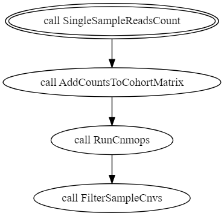

# Single sample germline CNV Calling

CNV calling pipeline detects CNVs for an input sample based on sample’s coverage changes while taking into account a default cohort’s coverage properties. CNV detection is done using the cn.mops tool which allows calling CNVs relative to the whole cohort, which greatly facilitates bias normalization.

## Workflow Overview
The pipeline takes a single sample aligned file (bam/cram) and calculates the reads counts per window (constant number of bp) along the genome. 
The sample’s reads counts are added to a predefined cohort reads count matrix. 
The combined matrix is used as input for cn.mops algorithm to detect CNVs for the entire cohort. 
Finally, the sample’s CNVs are extracted and filtered by length and low confidence regions.



## Requirements

The workflow assume that you have coverage representation of the sample of interest in one of the following formats: 
1. BAM/CRAM - an aligned, sorted, duplicate marked UG BAM/CRAM file. 
2. BedGraph - Previously calculated input bedGraph holding the coverage per base (outputs with the sequencing data)
3. GenomicRanges object - Inputs sample windowed coverage stored as GenomicRanges object in rds file (can be calculated using cn.mops::getReadCountsFromBAM R function).

### Files required for the analysis (download locally)
The following files are publicly available

    gs://gcp-public-data--broad-references/hg38/v0/Homo_sapiens_assembly38.fasta
    gs://gcp-public-data--broad-references/hg38/v0/Homo_sapiens_assembly38.fasta.fai
    gs://concordanz/hg38/germline_CNV_cohort/v2.0/HapMap2_65samples_cohort_v2.0.hg38.ReadsCount.rds
    gs://concordanz/hg38/UG-High-Confidence-Regions/v1.4/ug_cnv_lcr.bed
	or 
	s3://ultimagen-workflow-resources-us-east-1/hg38/germline_CNV_cohort/v2.0/HapMap2_65samples_cohort_v2.0.hg38.ReadsCount.rds
	s3://ultimagen-workflow-resources-us-east-1/hg38/UG-High-Confidence-Regions/v1.4/ug_cnv_lcr.bed

The following files are required for input in BedGraph format

    gs://concordanz/hg38/Homo_sapiens_assembly38.chr1-24.w1000.bed
	or 
	s3://ultimagen-workflow-resources-us-east-1/hg38/Homo_sapiens_assembly38.chr1-24.w1000.bed
	
## Generating Germline CNV calls for a single sample

### Installation
* Install ugvc package:
    1. Clone the `VariantCalling` repository (e.g. to `software/VariantCalling`)
    2. Create a clean conda environment defined by `software/VariantCalling/setup/environment.yml`
    3. Create genomics.py3 conda environment:
    `conda env create -f software/VariantCalling/setup/environment.yml`
    This will create an environment called `genomics.py3`
    4. Create cn.mops conda environment:
    `conda env create -f software/VariantCalling/setup/other_envs/cnmops.yml`
    4. Install ugvc package:
    ```
    conda activate genomics.py3
    cd software/VariantCalling
    pip install .
    ```

### Single Sample coverage collection for the case input format is BAM/CRAM
```
conda activate genomics.py3
samtools view {input_bam_file} -O BAM -o {out_bam_filtered} -bq 1 -T Homo_sapiens_assembly38.fasta
samtools index {out_bam_filtered}

conda activate cn.mops
Rscript --vanilla  /VariantCalling/ugvc/cnv/get_reads_count_from_bam.R \
	-i {out_bam_filtered} \
	-refseq [
		"chr1","chr2","chr3","chr4","chr5","chr6","chr7","chr8","chr9","chr10","chr11",\
		"chr12","chr13","chr14","chr15","chr16","chr17","chr18","chr19","chr20","chr21",\
		"chr22","chrX","chrY"
	  ] \
	-wl 1000 \
	-p {cpu} \
	-o {sample_name}
```

### Single Sample coverage collection for the case input format is BedGraph
```
conda activate genomics.py3
bedtools map \
	-g Homo_sapiens_assembly38.fasta.fai \
	-a Homo_sapiens_assembly38.chr1-24.w1000.bed \
	-b {input_bed_graph} \
	-c 4 -o mean |\
	awk '{if($4=="."){print $1"\t"$2"\t"$3"\t"0}else{print $1"\t"$2"\t"$3"\t"$4}}' \
	> {sample_name}.win.bedGraph

conda run -n cn.mops \
	Rscript --vanilla /VariantCalling/ugvc/cnv/convert_bedGraph_to_Granges.R \
	-i {sample_name}.win.bedGraph \
	-sample_name {sample_name}
```

### Add sample coverage profile to the cohort
```
conda activate cn.mops
Rscript --vanilla /VariantCalling/ugvc/cnv/merge_reads_count_sample_to_cohort.R \
	-cohort_rc HapMap2_210samples_cohort.ReadsCount.rds\
	-sample_rc {sample_name}.ReadCounts.rds\
```
### Add sample coverage profile to the cohort
```
conda activate cn.mops
Rscript --vanilla /VariantCalling/ugvc/cnv/merge_reads_count_sample_to_cohort.R \
	-cohort_rc HapMap2_210samples_cohort.ReadsCount.rds\
	-sample_rc {sample_name}.ReadCounts.rds\
```

#### Run cn.MOPS to call CNVs
```
conda activate cn.mops
Rscript --vanilla /VariantCalling/ugvc/cnv/normalize_reads_count.R \
	--cohort_reads_count_file merged_cohort_reads_count.rds
	
Rscript --vanilla /VariantCalling/ugvc/cnv/cnv_calling_using_cnmops.R \
	-cohort_rc cohort_reads_count.norm.rds \
	-minWidth 1000 \
	--save_csv
```

#### Filter sample CNVs
```
conda activate genomics.py3
grep "{sample_name}" cohort.cnmops.cnvs.csv > {sample_name}.cnvs.csv
awk -F "," '{print $1"\t"$2-1"\t"$3"\t"$NF}' {sample_name}.cnvs.csv > {sample_name}.cnvs.bed;

python /VariantCalling/ugvc filter_sample_cnvs \
	--input_bed_file {sample_name}.cnvs.bed \
	--intersection_cutoff 0.5 \
	--cnv_lcr_file ug_cnv_lcr.bed\
	--min_cnv_length 10000;
```