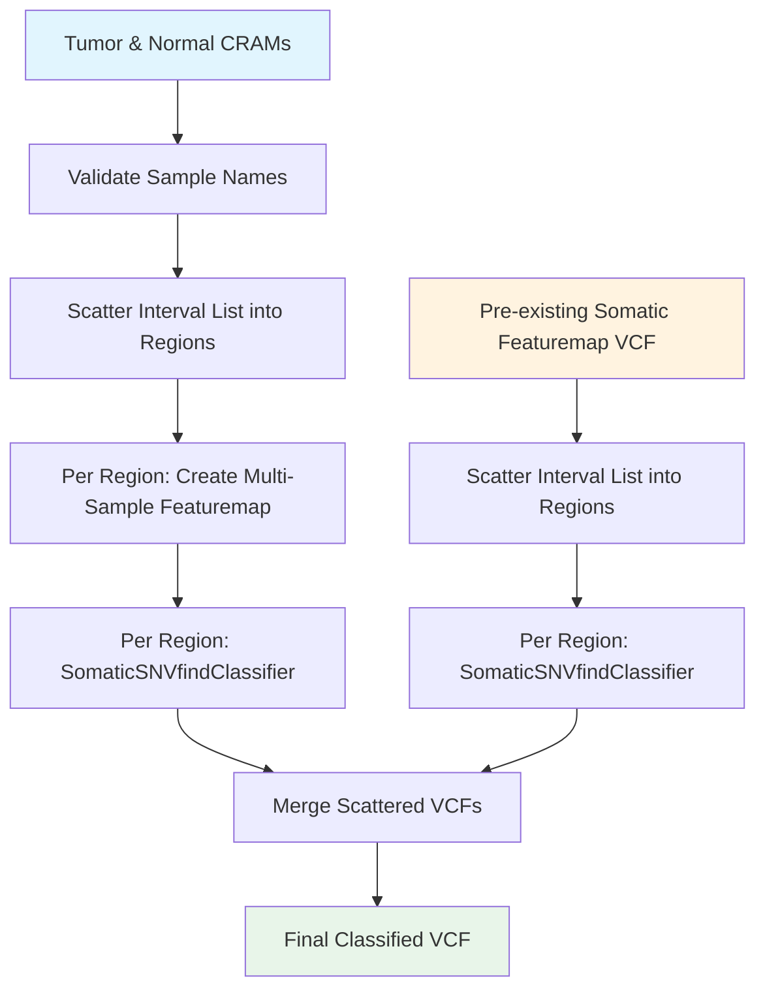

# Somatic SNVfind Workflow

## Overview

The SomaticSNVfind workflow performs somatic variant calling, producing a multi-sample somatic FeatureMap VCF file from matched tumor and normal samples. The workflow supports two execution modes:

1. **Full pipeline mode** — Takes matched tumor and normal CRAM files, creates a multi-sample featuremap (tumor + normal in one file) using pre-trained SingleReadSNV model, and classifies somatic variants.
2. **Classifier-only mode** — Takes a pre-existing somatic FeatureMap VCF and applies classification only (skips featuremap generation). 

To speed up the process, both modes scatter the genome into regions, running the featuremap creation and variant classification per region, and merge the results into a final VCF with somatic scoring.

## Requirements

### Input Files — Full Pipeline Mode

#### Required Files
- **Tumor CRAM files** and their index files (supports multiple CRAMs per sample; all must share the same sample name)
- **Normal CRAM files** and their index files (same requirements as tumor)
- **Reference genome** files (FASTA, FAI, and DICT)
- **Interval list** file defining genomic regions to process
- **Tandem repeats reference file** (BED format)
- **XGBoost model file** for somatic classification (`.json`)
- **Tumor SingleReadSNV model** — a `SingleReadSNVModel` struct containing `model_metadata` and `model_fold_files`
- **Normal SingleReadSNV model** — same struct as above, for the normal sample
- **FeatureMap parameters** — a `FeatureMapParams` struct controlling featuremap creation behavior

### Input Files — Classifier-Only Mode

#### Required Files
- **Pre-existing somatic featuremap VCF** and its `.tbi` index
- **Reference genome** files (FASTA, FAI, and DICT)
- **Interval list** file defining genomic regions to process
- **Tandem repeats reference file** (BED format)
- **XGBoost model file** for somatic classification (`.json`)

### Reference Files

The following reference files are publicly available:

```
gs://gcp-public-data--broad-references/hg38/v0/Homo_sapiens_assembly38.fasta
gs://gcp-public-data--broad-references/hg38/v0/Homo_sapiens_assembly38.fasta.fai
gs://gcp-public-data--broad-references/hg38/v0/Homo_sapiens_assembly38.dict
gs://concordanz/hg38/wgs_calling_regions.without_encode_blacklist.hg38.interval_list
gs://concordanz/hg38/tandem_repeats.hg38.bed
```

### Installation

Pull the required Docker images:

```
docker pull ultimagenomics/ugbio_featuremap:<release-tag>
docker pull ultimagenomics/featuremap:<release-tag>
```


For the latest Docker version, see: [globals.wdl](https://github.com/Ultimagen/healthomics-workflows/blob/main/workflows/somatic_snvfind/tasks/globals.wdl)

## Workflow Steps



### 1. Validate Tumor/Normal Sample Names (full pipeline mode only)

Extracts sample names from all tumor and normal CRAM files and validates that:
- All tumor CRAMs share the same sample name
- All normal CRAMs share the same sample name
- Tumor and normal sample names are different

From inside the `broadinstitute/gatk:4.6.0.0` Docker image, the sample name is extracted from each CRAM file using:

```
gatk GetSampleName \
    -I <cram_file> \
    -R <reference.fasta> \
    -O <sample_name.txt>
```

### 2. Scatter Interval List

Splits the genomic interval list into `num_shards` BED files for parallel processing. The `scatter_intervals_break` parameter controls the maximum region size (default: 10,000,000 bp).

From inside the `broadinstitute/gatk:4.6.0.0` Docker image:

```
gatk --java-options '-Xms4g' \
    IntervalListTools \
    SCATTER_COUNT=<num_shards> \
    SUBDIVISION_MODE=BALANCING_WITHOUT_INTERVAL_SUBDIVISION_WITH_OVERFLOW \
    UNIQUE=true \
    SORT=true \
    BREAK_BANDS_AT_MULTIPLES_OF=<scatter_intervals_break> \
    INPUT=<interval_list> \
    OUTPUT=out
```

Each output interval list is then converted to BED format:

```
grep -v @ <interval_list_file> | awk 'BEGIN{OFS="\t"}{print $1,$2-1,$3}' > <output.bed>
```

### 3. Create Multi-Sample Featuremap (full pipeline mode only)

For each genomic region, creates a multi-sample featuremap VCF containing both the tumor and normal samples in a single file. The tumor and normal CRAM files are processed jointly using their respective SingleReadSNV models, with somatic filter mode enabled (only the tumor sample is examined for quality filtering).

From inside the `ultimagenomics/featuremap:<release-tag>` Docker image:

```
snvfind \
    <tumor.cram>,<normal.cram> \
    <reference.fasta> \
    -o <output.featuremap.vcf.gz> \
    -M <tumor_model_metadata>,<normal_model_metadata> \
    -m 1 \
    -L 100 \
    -n \
    -Q 20 \
    -r 3 \
    -b <region.bed> \
    -F \
    -w 2
```

Key parameters controlling featuremap creation (via the `FeatureMapParams` struct):

| Parameter | Description |
|-----------|-------------|
| `min_mapq` (`-m`) | Minimum mapping quality |
| `score_limit` (`-L`) | Score limit |
| `exclude_nan_scores` (`-n`) | Exclude NaN scores |
| `surrounding_quality_size` (`-Q`) | Surrounding median and mean quality size |
| `reference_context_size` (`-r`) | Reference context size |
| `pileup_window_width` (`-w`) | Pileup window width |
| `somatic_filter_mode` (`-F`) | Only the first sample (tumor) is examined for quality filter |

### 4. Somatic SNVfind Classifier

For each genomic region, classifies somatic variants using an XGBoost model. In classifier-only mode, a `--regions-bed-file` argument restricts the pre-existing VCF to the current region.

From inside the `ultimagenomics/ugbio_featuremap:<release-tag>` Docker image:

```
somatic_snvfind_classifier \
    --somatic-snvfind-vcf <input.vcf.gz> \
    --output-vcf <output.classified.vcf.gz> \
    --genome-index-file <reference.fasta.fai> \
    --tandem-repeats-bed <tandem_repeats.bed> \
    --xgb-model-json <model.json> \
    --n-threads 2 \
    --output-parquet <output.aggregated.parquet> \
    --verbose
```

In classifier-only mode, add:

```
    --regions-bed-file <region.bed>
```

### 5. Merge Scattered VCFs

Concatenates all per-region classified VCF outputs into a single final VCF file.

From inside the `broadinstitute/gatk:4.6.0.0` Docker image:

```
bcftools concat <input1.vcf.gz> <input2.vcf.gz> ... | bcftools sort -T . -Oz -o <output.vcf.gz> -
bcftools index -t <output.vcf.gz>
```

## Output Files

### Primary Outputs
- **`<base_filename>.somatic_featuremap.vcf.gz`** — Final somatic featuremap VCF with classification scores
- **`<base_filename>.somatic_featuremap.vcf.gz.tbi`** — Index file for the final output VCF

### Debug Outputs
- **`aggregated_parquet`** — Array of per-region parquet files containing structured data from the classifier (features, scores, and results) for debugging and troubleshooting
